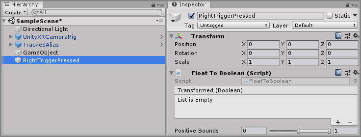
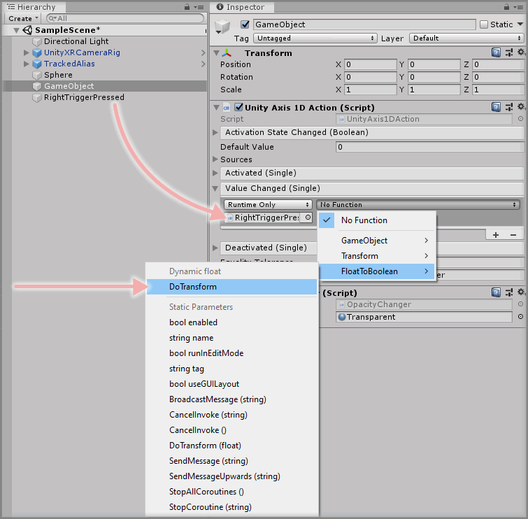
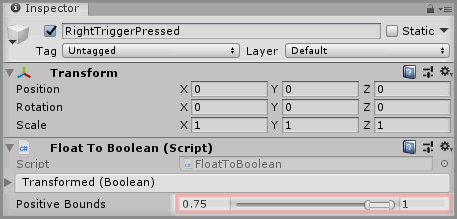
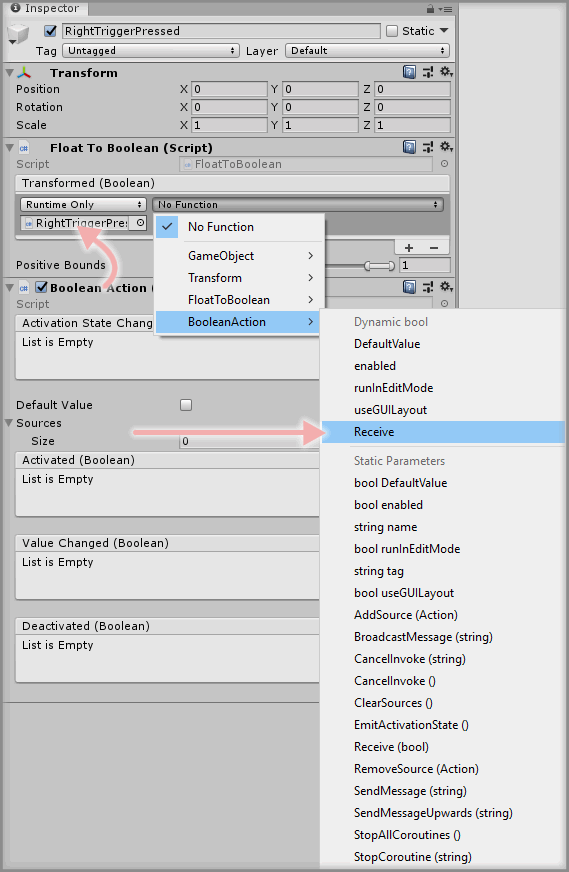

&gt; [Home](../../../../README.md) &gt; [How-to Guides](../../README.md) &gt; [Actions](../README.md)

# Converting A Float Action To A Boolean Action

> * Level: Beginner
>
> * Reading Time: 5 minutes
>
> * Checked with: Unity 2018.3.9f1

## Introduction

Sometimes you may want to use the values from a `FloatAction` to activate or deactivate an output type. For example, pressing down the trigger button axis on a controller causes an output to occur when the trigger is fully pressed down.

The Unity Axis Actions provide a way of getting the varying value data from an axis but don't really provide a way of letting us trigger something when that value reaches a specific value. This can be done by taking the float value and converting it into a boolean when the float value is within our specified bounds. We can then take this boolean value and pass it into a `Boolean Action` for hooking up events that are either on or off (true/false).

We can do this using the Data Type Converters provided with [Zinnia.Unity] which allow conversions from one DataType to another.

## Useful definitions

* `Zinnia` - A library containing a collection of reusable software design patterns for use with the Unity software.
* `Normalized` - A float value ranging from `0f` to `1f` or `-1f` representing the percentage of how far the value is between the minimum and maximum the value can be.

## Prerequisites

* A Unity 1D Axis Action exists in the scene. See [Adding A Unity Axis Action](../AddingAUnityAxisAction/README.md).

## Let's Start

### Step 1

Create a new Empty GameObject by selecting `Main Menu -> GameObject -> Create Empty` then rename the GameObject to `RightTriggerPressed` then click the `Add Component` button and select the `Float To Boolean` component.

### Step 2

Click on the `GameObject` GameObject in the Unity Hierarchy window (which was created in the [Adding A Unity Axis Action](../AddingAUnityAxisAction/README.md) guide) then drag and drop the `RightTriggerPressed` GameObject into the `Value Changed` event parameter on the `Unity 1D Axis Action` component.

> Note: This should override the old event listener. If there is no event listener present in the `Value Changed` event parameter then click the `+` symbol in the bottom right corner of the `Value Changed` event parameter on the `Unity 1D Axis Action` component to add a fresh event listener.

Select a `Function` to perform when the `Value Changed` event is emitted. For this example, select `FloatToBoolean -> DoTransform` (be sure to select `Dynamic float - DoTransform` for this example).

Our `Value Changed` event listener on the `Unity 1D Axis Action` will now attempt to convert our current axis value to a boolean any time the axis value changes.

### Step 3

Let's add some value boundaries of when our float value should be considered a true boolean. As axis values are normalized, we only need to define our positive bounds within the value of `0f` and `1f`. In the case of our example, we're listening for the Trigger axis on the Right Controller which has a minimum value of `0f` (i.e. not pressed at all) and a maximum value of `1f` (i.e. completely pressed down). Any value in between `0f` and `1f` will tell us how much pressure is being applied to the trigger when it is being squeezed. For example, a value of `0.5f` means the trigger is being pressed but the button is not all the way down, it's held about half way in.

Click on the `RightTriggerPressed` GameObject in the Unity Hierarchy window and look for the `Positive Bounds` parameter on the `Float To Boolean` component. This `Positive Bounds` parameter has two fields that define the lower bound and the upper bound. Any float value that falls within these bounds will be considered positive (i.e. a true boolean).

For our example, let's have it so the Trigger axis must be at least 75% of the way squeezed all the way up till being fully squeezed so enter `0.75` in the first field of the `Positive Bounds` parameter and leave the second field as `1f`.

### Step 4

Now let's hook up our `Float To Boolean` component to control a `Boolean Action`.

Click on the `Add Component` button on the `RightTriggerPressed` GameObject and then select the `Boolean Action` component.

Click the `+` symbol in the bottom right corner of the `Transformed` event parameter in the `Float To Boolean` component then drag and drop the `Boolean Action` component into the box that appears and displays `None (Object)`.

Select a `Function` to perform when the `Transformed` event is emitted. Choose `BooleanAction -> Receive` (be sure to select `Dynamic bool - Receive` for this example).

This will update our `Boolean Action` to be either `true` or `false` whenever the Trigger axis changes and falls within or outside the positive bounds we set.

### Done

Now you have a `Boolean Action` that will emit `true` when the Trigger axis is squeezed at least 75% and will emit `false` when is no longer squeezed as much. This `Boolean Action` can now be used to drive other output events too such as grabbing an item or even activating a pointer.

## Related Reading

* [Adding A Straight Pointer](../../Pointers/AddingAStraightPointer/README.md)
* [Adding A Curved Pointer](../../Pointers/AddingACurvedPointer/README.md)
* [Adding An Interactor](../../Interactions/AddingAnInteractor/README.md)

[Zinnia.Unity]: https://github.com/ExtendRealityLtd/Zinnia.Unity