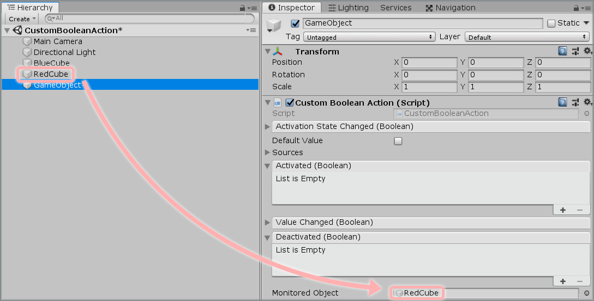
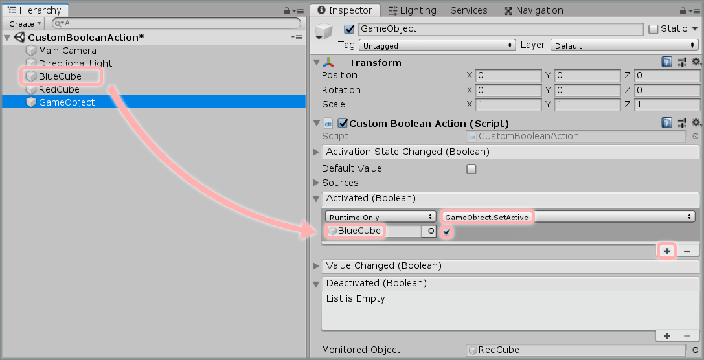
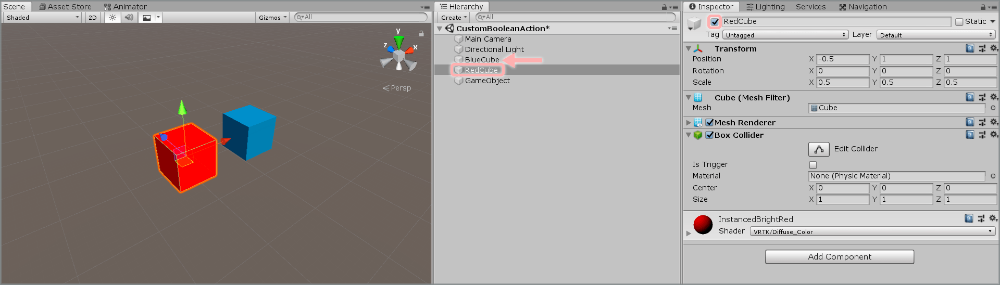
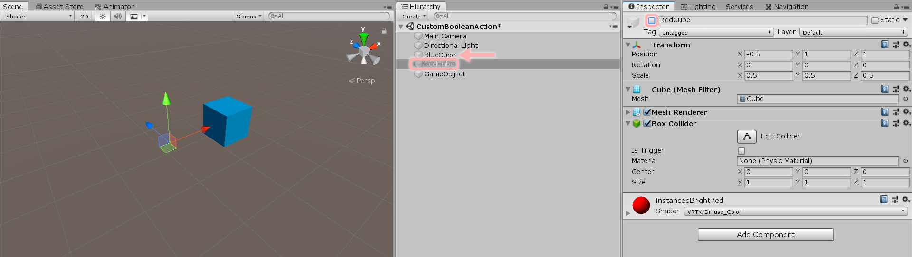

&gt; [Home](../../../../README.md) &gt; [How-to Guides](../../README.md) &gt; [Actions](../README.md)

# Creating a Custom Boolean Action

> * Level: Beginner
>
> * Reading Time: 5 minutes
>
> * Checked with: Unity 2018.3.11f1

## Introduction

Custom Boolean Actions emit events when a defined boolean value changes.

A Custom Boolean Action is derived from a [Zinnia.Unity] Action and therefore can be injected into any VRTK prefab that requires an initiating action (e.g. grab action in a `Interactor`).

## Useful definitions

* `Boolean Action` - A Zinnia.Action that emits events based on a bool value.
* `Zinnia` - A library containing a collection of reusable software design patterns for use with the Unity software.
* `Namespace` - A C# namespace is used to organize classes into distinct groups so duplicate definitions do not cause conflicts.

## Prerequisites

* Follow the [VRTK Getting Started] steps to add VRTK to your Unity project.

## Let's Start

### Step 1

Create a new `C# Script` and name it `CustomBooleanAction`, this script will be our new `Boolean Action` component.

Create two new `Cube` Unity 3D Objects by selecting `Main Menu -> GameObject -> 3D Object -> Cube` and change their `Transform` properties to:

* Position: `X = 0.5`, `Y = 1`, `Z = 1`
* Scale: `X = 0.5`, `Y = 0.5`, `Z = 0.5`

and 

* Position: `X = -0.5`, `Y = 1`, `Z = 1`
* Scale: `X = 0.5`, `Y = 0.5`, `Z = 0.5`

We will name them `BlueCube` and `RedCube` for clarity, let's also change their materials accordingly. 

We will be using these as a way of testing our `Boolean Action` by changing a `GameObject` activation state on and off based on another `GameObject` activation state.

Create an empty `GameObject` too, this is where we will set our `CustomBooleanAction` component.


### Step 2

Open the newly created `CustomBooleanAction` script. The Unity Software creates the default body for the script so right now it should look like this:

```csharp
using System.Collections;
using System.Collections.Generic;
using UnityEngine;

public class CustomBooleanAction : MonoBehaviour
{
  // Start is called before the first frame update
  void Start()
  {

  }

  // Update is called once per frame
  void Update()
  {

  }
}
```

We don't actually need most of that default code so delete the relevant lines so the code is at the following starting point:

```csharp
using UnityEngine;

public class CustomBooleanAction : MonoBehaviour
{

  void Update()
  {

  }

}
```

### Step 3

First thing we should do is wrap our class in a namespace to prevent any definitions we make such as the class name causing conflicts with duplicate class names elsewhere in the code base.

It's best practice to use the directory structure as the basis of the namespace so in the `Assets` directory create a new nested set of directories as such:
`Actions/BooleanActions/` and move the `CustomBooleanAction.cs` file inside that directory. Our namespace can then become the name of our project followed by the directory structure our script is found in. i.e.:

`Actions.BooleanActions`

So to add that namespace to our code, we simply wrap the class with a namespace block, like so:

```csharp
namespace Actions.BooleanActions
{
  using UnityEngine;

  public class CustomBooleanAction : MonoBehaviour
  {

    void Update()
    {

    }

  }
}
```

### Step 4

Currently the class extends the [MonoBehaviour](https://docs.unity3d.com/ScriptReference/MonoBehaviour.html) component. However, we want our component to be a Zinnia Boolean Action so we can emit a boolean value. To extend the Zinnia Boolean Action, we simply need to include the relevant Zinnia Action library in our class and make sure we extend it.

```csharp
namespace Actions.BooleanActions
{
  using UnityEngine;
  using Zinnia.Action;

  public class CustomBooleanAction : BooleanAction
  {

    void Update()
    {

    }

  }
}
```

### Step 5

We have two more things to do, first, let's add a GameObject variable to our CustomBooleanAction script, we will change the Boolean Action based on this GameObject state.

```csharp
namespace Actions.BooleanActions
{
  using UnityEngine;
  using Zinnia.Action;

  public class CustomBooleanAction : BooleanAction
  {

    [SerializeField]
    private GameObject MonitoredObject;

    void Update()
    {

    }

  }
}
```

Now, let's use the `Receive` method from Zinnia.Action to keep track of our `MonitoredObject` activation state.

```csharp
namespace Actions.BooleanActions
{
  using UnityEngine;
  using Zinnia.Action;

  public class CustomBooleanAction : BooleanAction
  {

    [SerializeField]
    private GameObject MonitoredObject;

    void Update()
    {
      Receive(MonitoredObject.activeInHierarchy);
    }

  }
}
```

> Note: `Receive` takes a boolean value and changes the Boolean Action state accordingly, keep in mind that its argument doesn't have to come from the same class, you can use any boolean value from anywhere in your project.

### Step 6

Now, add the script to the empty GameObject in order to see it as a component. 


Then, drag and drop the `RedCube` into the `MonitoredObject` variable.



### Step 7

The `Custom Boolean Value` component has 4 events that can be hooked into:

* Activation State Changed: Emitted when the activation state of the action changes from the previous state.
* Activated: Emitted when the boolean value in the `Receive` method is true (Once).
* Value Changed: Emitted when the state of the boolean value in the `Receive` changes, e.g. goes from being true to being false.
* Deactivated: Emitted when the boolean value in the `Receive` method is false (Once).

For an example of how to hook these events into doing something, let's make the `BlueCube` GameObject disappear when our `Custom Boolean Value` activation state is false and then have it reappear when the `Custom Boolean Value` activation state is true.

Click the `+` symbol in the bottom right corner of the `Activated` event parameter in the `Custom Boolean Action` component and then drag and drop the `BlueCube` GameObject into the box that appears and displays `None (Object)`.

Select a `Function` to perform when the `Activated` event is emitted. For this example, select `GameObject -> SetActive(bool)` (be sure not to select `Dynamic bool - SetActive` for this example).



Do the same with the `Deactivated` event, selecting `GameObject -> SetActive(bool)` again, with a different argument.


### Step 8

Play the Unity scene and change the `RedCube` activation state in the inspector, the `BlueCube` GameObject will disappear when the `RedCube` object is deactivated and reappear when the `RedCube` object is activated.



### Step 9

Now, let's add some extra functionality to our Boolean Action. We will add a bool variable that allows us to flip our script behaviour.

To do this, we have to create a bool variable in the script.

```csharp
namespace Actions.BooleanActions
{
  using UnityEngine;
  using Zinnia.Action;

  public class CustomBooleanAction : BooleanAction
  {

    [SerializeField]
    private bool flip = false;
    
    [SerializeField]
    private GameObject MonitoredObject;

    void Update()
    {
      Receive(MonitoredObject.activeInHierarchy);
    }

  }
}
```

Next, let's add an if statement that will send the `MonitoredObject` activation state negated to the `Receive` method if the `flip` variable is True.

```csharp
namespace Actions.BooleanActions
{
  using UnityEngine;
  using Zinnia.Action;

  public class CustomBooleanAction : BooleanAction
  {

    [SerializeField]
    private bool flip = false;
    
    [SerializeField]
    private GameObject MonitoredObject;

    void Update()
    {
      if(flip){
        Receive(!MonitoredObject.activeInHierarchy);
      }
      else{
        Receive(MonitoredObject.activeInHierarchy);
      }
    }

  }
}
```

You can add as many `Receive` methods as you want in a script in order to create more complex behaviours.

### Step 10

Play the Unity scene and change the `RedCube` activation state in the inspector again.
If you set the `flip` value to `True` the `BlueCube` GameObject will disappear when the `RedCube` object is activated and reappear when the `RedCube` object is deactivated.



### Done

Now you have a custom Boolean Action performing the action of hiding and showing another GameObject based on another GameObject activation state.

If you require many different inputs to perform the same output, then you don't want to have to wire up the same action outcomes in all of the Actions you add to your scene. This can be streamlined by creating Proxy Actions and chaining actions together.

## Related Reading

* [Adding A Unity Axis Action](../AddingAUnityAxisAction/README.md)
* [Creating Proxy Actions And Chaining Actions](../CreatingProxyActionsAndChainingActions/README.md)
* [Adding A Straight Pointer](../../Pointers/AddingAStraightPointer/README.md)
* [Adding A Curved Pointer](../../Pointers/AddingACurvedPointer/README.md)
* [Adding An Interactor](../../Interactions/AddingAnInteractor/README.md)

[Zinnia.Unity]: https://github.com/ExtendRealityLtd/Zinnia.Unity
[VRTK Getting Started]: https://github.com/ExtendRealityLtd/VRTK#getting-started
