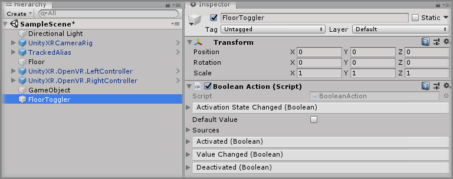
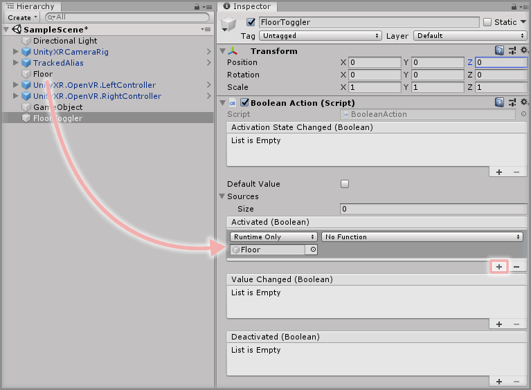
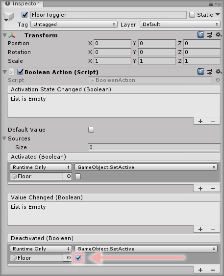
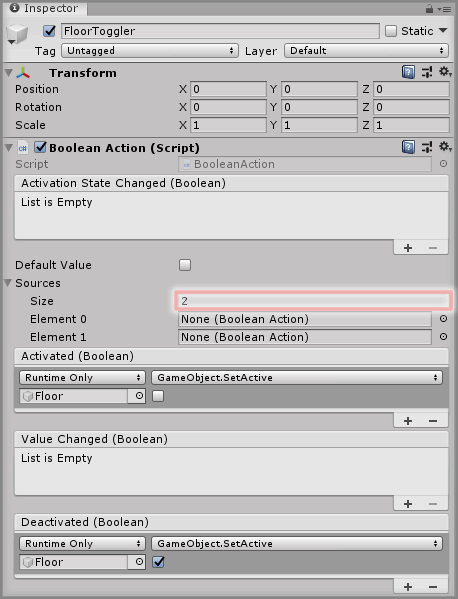
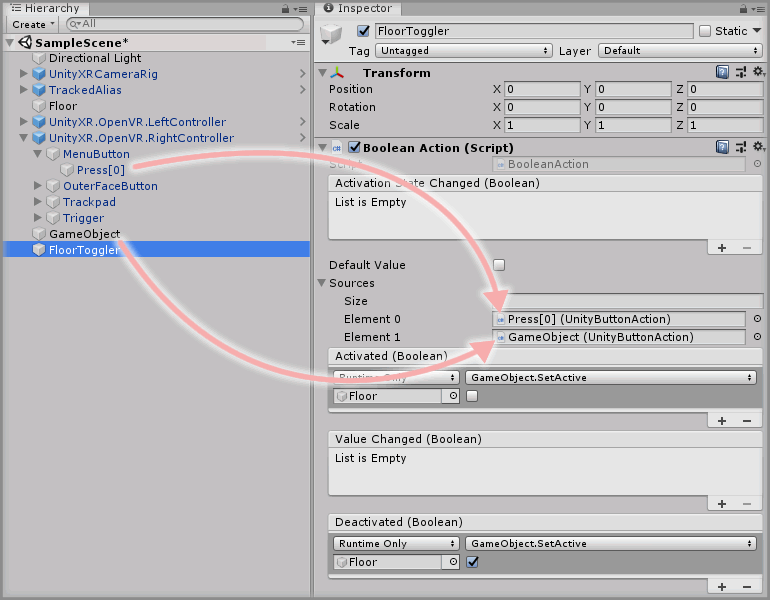
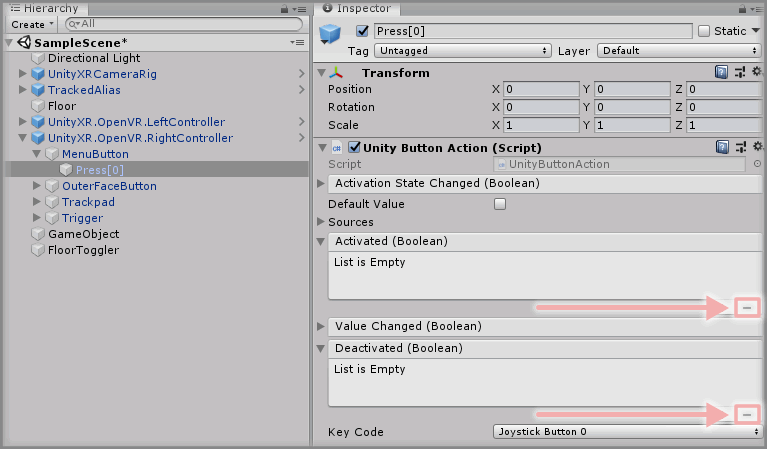
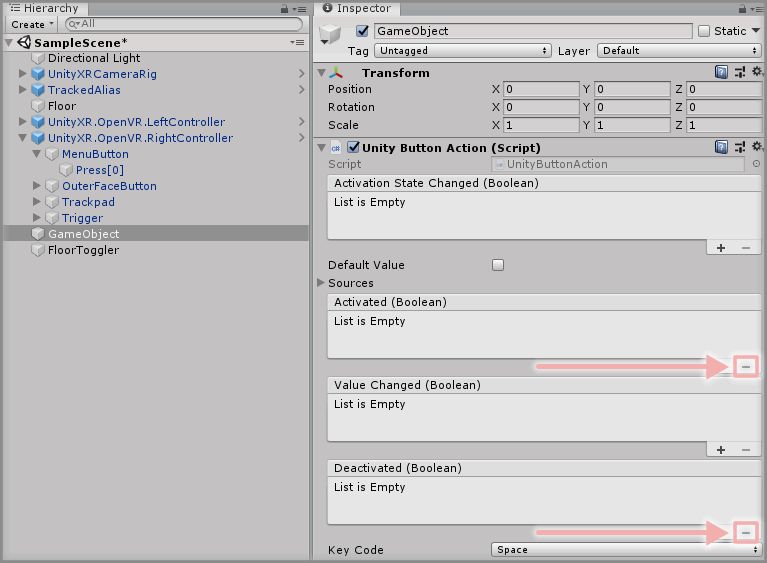

&gt; [Home](../../../../README.md) &gt; [How-to Guides](../../README.md) &gt; [Actions](../README.md)

# Creating Proxy Actions And Chaining Actions

> * Level: Beginner
>
> * Reading Time: 5 minutes
>
> * Checked with: Unity 2018.3.9f1

## Introduction

It is sometimes desirable to have many different input actions all have the same outcome. It is possible to simply do this by wiring up all of the events in all of the actions to have the same output, however this can get cumbersome and hard to maintain.

The Zinnia Actions can be used as proxies to enable chaining of Actions to all drive the same outcome defined in one place.

Following on from the scene created in [Adding A Unity Button Action](../AddingAUnityButtonAction/README.md), we're going to move the Action functionality to a Proxy Action and then chain the button press Action and keyboard Action to this newly created Proxy Action. This will move our output functionality into one place and allow us to call it from many different actions.

## Useful definitions

* `Zinnia` - A library containing a collection of reusable software design patterns for use with the Unity software.

## Prerequisites

* A Unity Button Action exists in the scene. See [Adding A Unity Button Action](../AddingAUnityButtonAction/README.md).

## Let's Start

### Step 1

Create an empty `GameObject` in the Unity Hierarchy and rename it to `FloorToggler` then click the `Add Component` button and select the `Boolean Action` component.

This newly created `Boolean Action` will be the action that defines how we toggle the active state of the `Floor` GameObject.

### Step 2

Click the `+` symbol in the bottom right corner of the `Activated` event parameter in the `Boolean Action` component and then drag and drop the `Floor` GameObject into the box that appears and displays `None (Object)`.

Select a `Function` to perform when the `Activated` event is emitted. For this example, select `GameObject -> SetActive(bool)` (be sure not to select `Dynamic bool - SetActive` for this example).

### Step 3

Do the same as Step 2 but for the `Deactivated` event parameter in the `Boolean Action` component, but tick the checkbox under the `GameObject.SetActive` function.

### Step 4

Now we have a generic Action that will disable the `Floor` GameObject when the Action receives `true` and will re-enable the `Floor` GameObject when the Action receives `false`.

We _could_ hook up the `Unity Button Action` `Value Changed` event to simply call the `Receive` method on our `FloorToggler` GameObject `BooleanAction` component and this will pass the state of the `Unity Button Action` over to the `Boolean Action` whenever the value changes. However, doing this means for every input action, we'd need to wire up their `Value Changed` event to point to the `Receive` method on our `BooleanAction` component. This can again get very cumbersome and hard to maintain, so instead we're going to use the `Sources` parameter that is available on a `Zinnia.Action`.

The `Sources` parameter allows us to specify other Actions for our `BooleanAction` to monitor changes on and re-emit any events that happen on those source actions.

Expand the `Sources` parameter and enter the desired number of other Actions to monitor in the `Size` parameter field. In this example, we want to watch two other Actions (the Menu Button `Unity Button Action` and the Space Key `Unity Button Action`) so enter `2` into the `Sizes` parameter field.

### Step 5

Drag and drop the `UnityXR.OpenVR.RightController -> MenuButton -> Press[0]` GameObject into the `Sources -> Size -> Element 0` slot on the `FloorToggler` GameObject `BooleanAction` component. This will set the `Unity Button Action` component on the `Press[0]` GameObject as a `Source` on the `BooleanAction` component on the `FloorToggler` GameObject.

Drag and drop the `GameObject` GameObject that contains the `Unity Button Action` component that is working with the Space Key into the `Sources -> Size -> Element 1` slot on the `FloorToggler` GameObject `BooleanAction` component as well.

### Step 6

The `Unity Button Action` events still have actions to perform when either the Menu Button is pressed or the Space Key is pressed, we no longer need those actions on those `Unity Button Action` components now as they are being chained to our new `FloorToggler` GameObject `BooleanAction` component. So let's remove the event listeners from the other `Unity Button Action` components.

Select the `UnityXR.OpenVR.RightController -> MenuButton -> Press[0]` GameObject and click the `-` symbol in the bottom right corner of the `Activated` event parameter and the `Deactivated` event parameter on the `Unity Button Action` component. This will remove those event listeners and make this `Unity Button Action` component an Action that on its own does nothing other than listen for button presses on the Menu Button.

Let's do the same with the `Unity Button Action` component on the `GameObject` GameObject that is set up to listen for the Space Key press. Select the `GameObject` GameObject and click the `-` symbol in the bottom right corner of the `Activated` event parameter and the `Deactivated` event parameter on the `Unity Button Action` component.

### Done

There is now a single defined action in the scene that controls the active state of the `Floor` GameObject and we've hooked up two other actions that deal with listening for input from the Menu Button and Space Key to perform the output action of toggling the floor state.

This ability to create a Proxy Action and then chain other Actions makes it possible to drive a single output Action based on multiple different input Actions.

Play the Unity scene and you will be able to press the Menu Button on the Right Controller to make the `Floor` GameObject disappear or you can press the Space Key to also make the `Floor` GameObject disappear.

## Related Reading

* [Adding A Unity Axis Action](../AddingAUnityAxisAction/README.md)

[Zinnia.Unity]: https://github.com/ExtendRealityLtd/Zinnia.Unity
[Unity Input for OpenVR Controllers]: https://docs.unity3d.com/Manual/OpenVRControllers.html