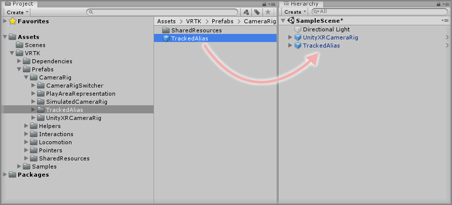

&gt; [Home](../../../../README.md) &gt; [How-to Guides](../../README.md) &gt; [Basics](../README.md)

# Adding A TrackedAlias

> * Level: Beginner
>
> * Reading Time: 2 minutes
>
> * Checked with: Unity 2018.3.6f1

## Introduction

The TrackedAlias prefab provides a way of attaching elements to Camera Rig configurations without specifically tying them to the underlying SDK Camera Rig.

This is useful if you want to support multiple SDK Camera Rigs in your scene but don't want to duplicate the same child GameObjects of all the relevant SDK Camera Rigs.

## Useful definitions

* `SDK Camera Rig` - A prefab from a specific 3rd party plugin (or SDK) that provides the basis for an XR Camera Rig setup (e.g. SteamVR or Oculus Integration).

## Prerequisites

* A UnityXRCameraRig is placed in the scene. See [Adding The UnityXRCameraRig](../AddingTheUnityXRCameraRig/README.md).

## Let's Start

### Step 1

Expand the VRTK directory in the Unity Project window until the `VRTK -> Prefabs -> CameraRig -> TrackedAlias` directory is visible then drag and drop the `TrackedAlias` prefab into the Hierarchy window.

### Step 2

Select the `TrackedAlias` GameObject in the Unity Hierarchy window then change the `Tracked Alias Facade` component and increase the `Camera Rigs` size property by `1` (it will be `0` by default so change it to `1`)

### Step 3

Drag the `UnityXRCameraRig` GameObject from the Unity Hierarchy window and drop it into the newly displayed `Element` property underneath the `Tracked Alias Facade` component `Camera Rigs` property.

### Done

Now you have a TrackedAlias in your scene that will track the first active valid Camera Rig that is set in the Camera Rigs list. At the moment there is only one Camera Rig set so it will only be tracking the UnityXRCameraRig.

You can now place other GameObjects in the TrackedAlias child GameObjects and they will follow the active SDK Camera Rig without being specifically tied to it.

## Related Reading

* [Adding A Unity Button Action](../AddingAUnityButtonAction/README.md)
* [Adding A Unity Axis Action](../AddingAUnityAxisAction/README.md)