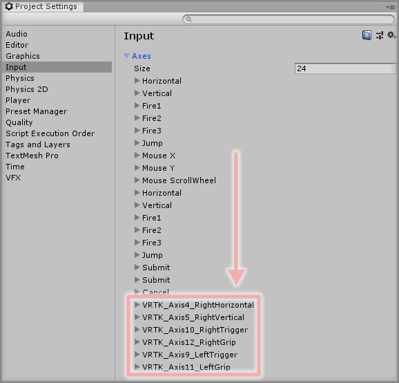
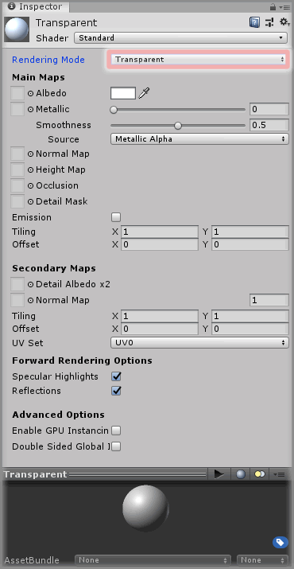
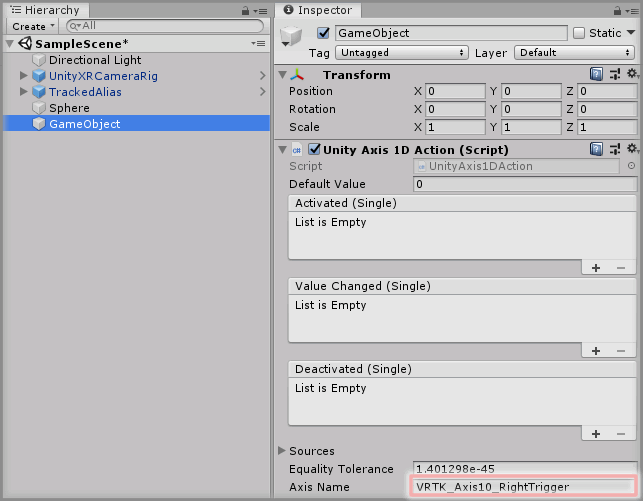
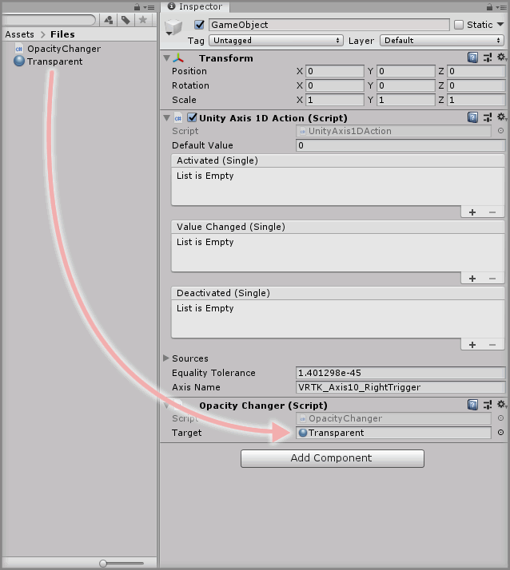
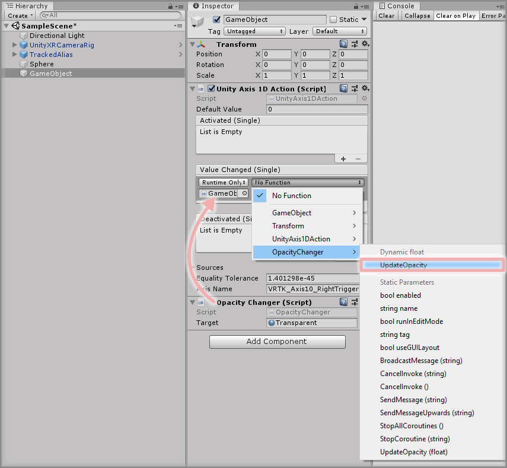
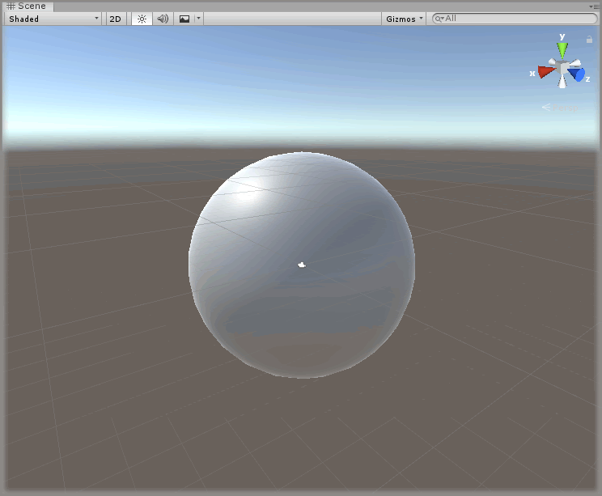

&gt; [Home](../../../../README.md) &gt; [How-to Guides](../../README.md) &gt; [Basics](../README.md)

# Adding A Unity Axis Action

> * Level: Beginner
>
> * Reading Time: 10 minutes
>
> * Checked with: Unity 2018.3.6f1

## Introduction

Unity Axis Actions tie into the Unity Input Manager and emit events when a defined Input axis changes value. There are two kinds of Unity Axis Action:

* Unity 1D Axis: listens for changes on a single axis and emits a float value for the axis changes.
* Unity 2D Axis: listens for changes on a two axes and emits a Vector2 value combining both axis changes.

A Unity Axis Action is derrived from a [Zinnia.Unity] Action and therefore can be injected into any VRTK prefab that requires varying float data (e.g. touchpad movement).

VRTK will ask via a popup window on first load of the Unity project whether to attempt to auto create some Unity axis input mappings. If this is accepted then default axis data for left and right controller touchpad/thumbsticks, grip and trigger axes will be created.

## Useful definitions

* `Unity Input Manager` - Manages the definition of inputs within the Unity software such as button, keyboard, mouse presses along with axis data.
* `Zinnia` - A library containing a collection of reusable software design patterns for use with the Unity software.

## Prerequisites

* A TrackedAlias is set up in the scene. See [Adding A TrackedAlias](../AddingATrackedAlias/README.md).

## Let's Start

### Step 1

Confirm that the Unity Input Manager has some predefined axes set up by selecting `Main Menu -> Project Settings` then selecting `Input` from the left hand list in the `Project Settings` window.

Expand the `Axes` collapsed item if necessary and confirm there are some VRTK axis entries.



If the VRTK axis entries don't appear, then the VRTK popup window can be accessed by selecting `Main Menu -> Window -> VRTK -> Manage Input Mappings`.

The VRTK axis input mappings relate to the standard axes outlined at the [Unity Input for OpenVR Controllers].

### Step 2

Create a new `Sphere` Unity 3D Object by selecting `Main Menu -> GameObject -> 3D Object -> Sphere` so we can test the Unity Axis Action.

Create a new `Material` in the Unity Project and keep it on the `Standard` shader but change the `Rendering Mode` to `Transparent`.



Then apply this newly created `Material` to the `Sphere` GameObject that was just created. We'll use this material to change the opacity of the Sphere based on the value from an axis.

### Step 3

The `Unity Axis 1D Action` and `Unity Axis 2D Action` components have 3 events that can be hooked into:

* Activated: Emitted when the axis value is no longer at the set default value.
* Value Changed: Emitted when the axis value changes.
* Deactivated: Emitted when the axis value returns to the set default value.

Let's create a `Unity Axis 1D Action` component to track the press of the right controller trigger and the press of the trigger will control the opacity of the `Sphere` GameObject.

Create an Empty GameObject in the Unity Hierarchy then click the `Add Component` button and select the `Unity 1D Axis Action` component.

In the `Axis Name` parameter of the `Unity 1D Axis Action` component and enter `VRTK_Axis10_RightTrigger` as the value. This is the predefined name associated with the right controller trigger axis as defined by the Unity Input Manager.



We now have a Unity Axis Action tracking the value of the right controller trigger axis.

### Step 4

We'll need a small script that allows us to change the opacity of the material applied to the `Sphere` GameObject. Create a new `Script` and name it `OpacityChanger`.

Copy the below code into that newly created `OpacityChanger` script:

```
using UnityEngine;
public class OpacityChanger : MonoBehaviour
{
    public Material target;
    public void UpdateOpacity(float alphaValue)
    {
        Color color = target.color;
        color.a = alphaValue;
        target.color = color;
    }
}
```

This simple script has a public parameter that allows us to specify a material as the target to change the alpha on and a public method we can call from an event whilst passing a float value to determine what the opacity alpha value should be for the material.

Add the `OpacityChanger` component the same GameObject as the `Unity 1D Axis Action` then drag and drop the created `Material` into the `Target` parameter on the `OpacityChanger` component.



### Step 5

Now to set up the `Unity 1D Axis Action` component to change the opacity of the material when the trigger is pressed and depressed.

Click the `+` symbol in the bottom right corner of the `Value Changed` event parameter in the `Unity 1D Axis Action` component and then drag and drop the `Opacity Changer` component into the box that appears and displays `None (Object)`.

Select a `Function` to perform when the `Value Changed` event is emitted. For this example, select `OpacityChanger -> UpdateOpacity` (be sure to select `Dynamic float - UpdateOpacity` for this example).



### Done

Play the Unity scene and gradually squeeze and release the trigger on the right controller and the opacity of the `Sphere` GameObject will become more opaque the more the trigger is squeezed.

This is because when the trigger is not being touched at all, the axis value for the trigger will be `0` and when the trigger is fully squeezed in, the axis value will be `1`. The value of the trigger axis can be anything between `0` and `1` depending on the amount of pressure applied to the trigger. This axis value is then being passed into the alpha channel of the material color and a value of `1` will mean the material is fully opaque, whereas a value of `0` will mean the material is fully transparent.



## Related Reading

* [Adding A Unity Button Action](../AddingAUnityButtonAction/README.md)
* [Creating Proxy Actions And Chaining Actions](../CreatingProxyActionsAndChainingActions/README.md)

[Zinnia.Unity]: https://github.com/ExtendRealityLtd/Zinnia.Unity
[Unity Input for OpenVR Controllers]: https://docs.unity3d.com/Manual/OpenVRControllers.html