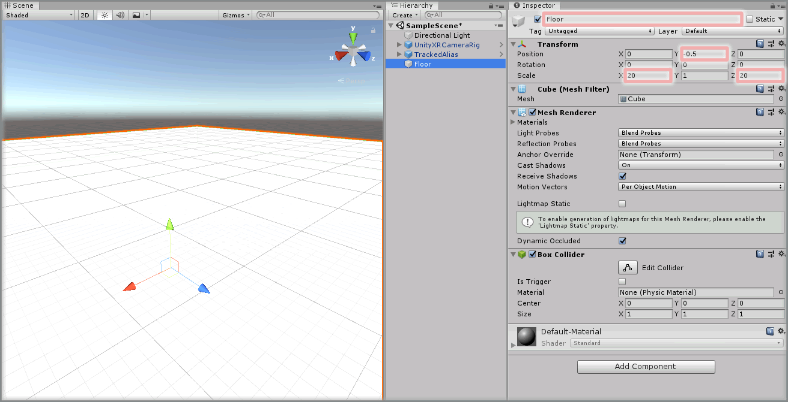
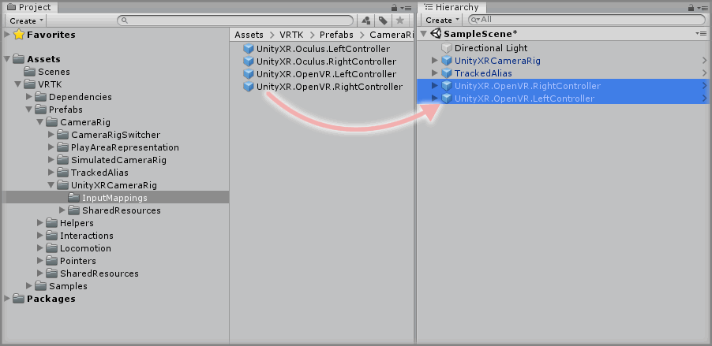
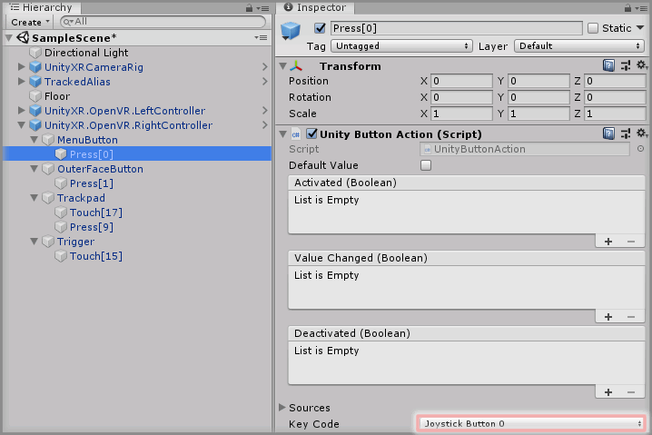
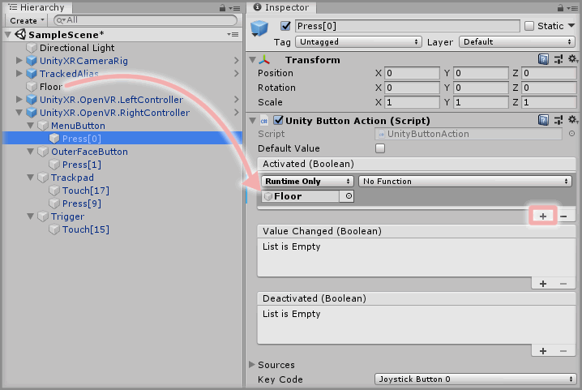
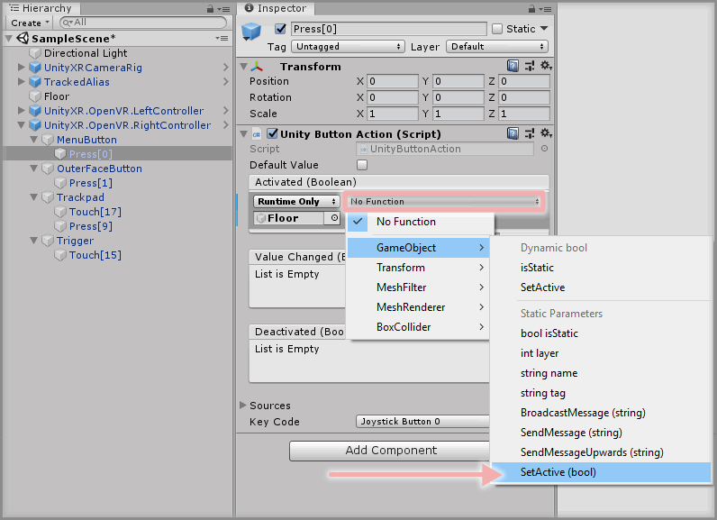
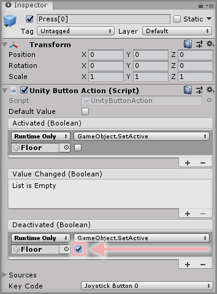
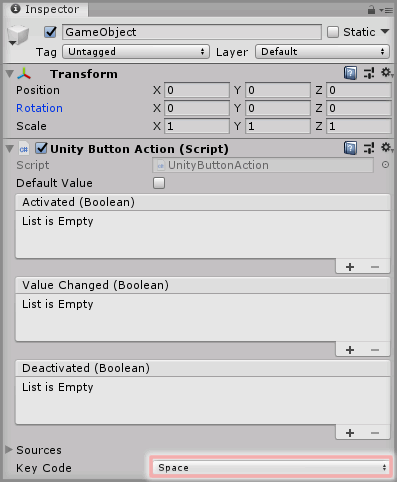
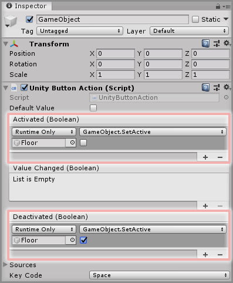

&gt; [Home](../../../../README.md) &gt; [How-to Guides](../../README.md) &gt; [Basics](../README.md)

# Adding A Unity Button Action

> * Level: Beginner
>
> * Reading Time: 5 minutes
>
> * Checked with: Unity 2018.3.6f1

## Introduction

Unity Button Actions tie into the Unity Input Manager and emit events when an defined Input button is pressed and released.

A Unity Button Action is derrived from a [Zinnia.Unity] Action and therefore can be injected into any VRTK prefab that requires an initiating action (e.g. pointer activation).

VRTK comes with some prebuilt prefabs containing common button mappings for OpenVR and Oculus controllers.

## Useful definitions

* `Unity Input Manager` - Manages the definition of inputs within the Unity software such as button, keyboard, mouse presses along with axis data.
* `Zinnia` - A library containing a collection of reusable software design patterns for use with the Unity software.

## Prerequisites

* A TrackedAlias is set up in the scene. See [Using The TrackedAlias With The UnityXRCameraRig](../UsingTheTrackedAliasWithTheUnityXRCameraRig/README.md).

## Let's Start

### Step 1

Create a new `Cube` Unity 3D Object by selecting `Main Menu -> GameObject -> 3D Object -> Cube` then rename the GameObject to `Floor` and change the `Transform` properties to:

* Position: `X = 0`, `Y = -0.5`, `Z = 0`
* Scale: `X = 20`, `Y = 1`, `Z = 20`

This will form the basic floor of the virtual world and provide a way of testing a button action by toggling this GameObject on and off when a button on a controller is pressed.

### Step 2

Expand the VRTK directory in the Unity Project window until the `VRTK -> Prefabs -> CameraRig -> UnityXRCameraRig -> InputMappings` directory is visible then drag and drop the relevant controller prefabs into the scene. For this example, drag the `UnityXR.OpenVR.LeftController` prefab and drag the `UnityXR.OpenVR.RightController` prefab into the Hierarchy window.

> Note: The OpenVR Input Mappings provide the base buttons available on the HTC Vive wand controller and do not include any axis data such as touchpad, trigger or grip press as these are not defined by default by the Unity Input Manager.

### Step 3

Select the appropriate controller Input Mapping GameObject in the Unity Hierarchy window and expand the sub elements to expose the available input mapping actions.

Select the `UnityXR.OpenVR.RightController -> MenuButton -> Press[0]` GameObject which will display the `Unity Button Action` component that relates to the Right Controller's Menu Button press action.

> Note: The `Key Code` parameter on the `Unity Button Action` component is set to `Joystick Button 0` which is the Unity Input Mapping for the OpenVR controllers as outlined at the [Unity Input for OpenVR Controllers].

### Step 4

The `Unity Button Action` component has 3 events that can be hooked into:

* Activated: Emitted when the button is pressed down.
* Value Changed: Emitted when the state of the button value changes, e.g. goes from being pressed down to being released.
* Deactivated: Emitted when the button is released and no longer pressed down.

For an example of how to hook these events into doing something, let's make the `Floor` GameObject disappear when the Right Controller Menu Button is pressed and then have it reappear when the button is released.

Click the `+` symbol in the bottom right corner of the `Activated` event parameter in the `Unity Button Action` component and then drag and drop the `Floor` GameObject into the box that appears and displays `None (Object)`.

Select a `Function` to perform when the `Activated` event is emitted. For this example, select `GameObject -> SetActive(bool)` (be sure not to select `Dynamic bool - SetActive` for this example).

### Step 5

Do the same as Step 4 but for the `Deactivated` event parameter in the `Unity Button Action` component, but tick the checkbox under the `GameObject.SetActive` function.

Play the Unity scene and press the Right Controller Menu Button and the `Floor` GameObject will disappear when the button is pressed down and reappear when the button is released.

### Step 6

Let's create a custom Unity Button Action to do the same action as outlined aboved but based on a keyboard press.

Create an Empty GameObject in the Unity Hierarchy then click the `Add Component` button and select the `Unity Button Action` component.

Change the `Key Code` parameter on this new `Unity Button Action` component to the desired keyboard button to listen for e.g. `Space` for listening to when the Space Bar on the keyboard is pressed.

### Step 7

Follow Step 4 and Step 5 but for this new `Unity Button Action` component to add the relevant actions to happen on the `Activated` event and `Deactivated` event for when the Space Bar is pressed down and released.

Play the Unity scene and press the Space Bar on the keyboard and the `Floor` GameObject will disappear when the key is pressed down and reappear when the key is released.

### Done

Now you have a predefined OpenVR controller button action performing the action of hiding and showing another scene GameObject when it is pressed and released. Also, a second Unity Button Action tied to the Space Bar on the keyboard that performs the same action of hiding and showing another scene GameObject.

Duplicating Action outcomes is not ideal as if you require many different inputs to perform the same output, then you don't want to have to wire up the same action outcomes in all of the Actions you add to your scene. This can be streamlined by creating Proxy Actions and chaining actions together.

## Related Reading

* ...Action Chaining
* ...Unity Axis Actions
* ...Hooking up an action to a Pointer

[Zinnia.Unity]: https://github.com/ExtendRealityLtd/Zinnia.Unity
[Unity Input for OpenVR Controllers]: https://docs.unity3d.com/Manual/OpenVRControllers.html