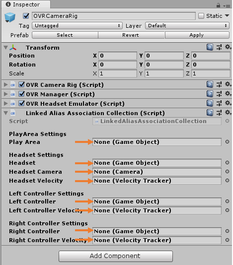
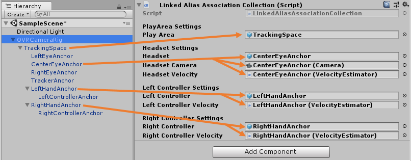

&gt; [Home](../../../../README.md) &gt; [How-to Guides](../../README.md) &gt; [Basics](../README.md)

# Adding The Oculus OVRCameraRig

## Introduction

  > * Level: Beginner
  > * Reading Time: 2 minutes
  > * Checked with: 
  >   * Unity 2018.2  - Watch out: Unity 2018.3 is currently not compatible with Oculus Integration
  >   * Oculus Integration v1.32

The Oculus OVRCameraRig helper prefab provides a camera that tracks the HMD rotation and position along with any available Oculus controllers.

The outcome of this How-To Guide is to learn how to add the Oculus OVRCameraRig prefab to the scene and configure it for the tracking space type you require.

## Useful definitions

* `HMD` - A Head Mounted Display is a display device that is worn on the head, usually a VR/AR Headset.
* `CameraRig` - A GameObject that contains a HMD representation and controller representations.
* `OVRCameraRig` - A GameObject that contains the OculusVR version of the CameraRig. It comes with Oculus Integration (see prerequisites)
* `6 degrees of freedom` - An object that is real world tracked in the 3 rotational axes and 3 directional axes, also known as room scale tracking.
* `3 degrees of freedom` - An object that is real world tracked in only the 3 rotational axes and no directional axes, also known as stationary tracking.

## Prerequisites

* Add [VRTK.Unity.Core] to your Unity3d project.

* Add [Oculus Integration] from AssetStore to your Unity3d project

  

  * Hint: For getting started you will only need the VR subfolder of the package.

    
  * After the import you might be asked to update your Oculus Utilities Plugin

    

    Hit `Yes` and Restart Unity after the update.

  

## Let's Start

### Step 1

Expand the Oculus directory in the Unity3d Project window until the `Oculus -> VR -> OVRCameraRig` directory is visible.

### Step 2

Select the `OVRCameraRig` prefab, then drag and drop it into the Hierarchy window.

### Step 3

Select the `OVRCameraRig` GameObject in the Unity3d Hierarchy window and change the `OVR Manager (Script)` component to suit your Tracking Space requirements.

* Ensure the `Tracking Origin Type` is set to:
  * `Eye Level` for Oculus devices that support 6 degrees of freedom tracking (the ability to move around your play area).
  * `FloorLevel` for Oculus devices that support 3 degrees of freedom tracking (only the ability to look around but not move within your play area), like the GearVR or OculusGo.

    

    See [Oculus Unity Documentation](https://developer.oculus.com/documentation/unity/latest/concepts/unity-utilities-overview/) for details.

### Step 4

To use `OVRCameraRig`  with VRTK4, a script component needs to be added to the rig.

* In the Project window, expand `Assets -> VRTK.Unity.Core -> Scripts -> Tracking -> CameraRig` and find the `LinkedAliasAssociationCollection` script.

  
* Drag the `LinkedAliasAssociationCollection` onto the `OVRCameraRig` in the Hierarchy window

  

### Step 5

The `Linked Alias Association Collection (Script)` component needs to be configured by referencing the right game objects.

* Select the `OVRCameraRig` in the Hierarchy window.

* In the Inspector, find its `Linked Alias Association Collection (Script)`  component. In here several Game Objects need to be specified.
  

  

* In the Hierarchy window, open the `OVRCameraRig -> TrackingSpace`. Drag the following GameObjects from there to the specified fields in `Linked Alias Association Collection (Script)`

  * `TrackingSpace` to `Play Area`
  * `CenterEyeAnchor` to `Headset` and `Headset Camera`
  * `LeftHandAnchor` to `Left Controller`
  * `RightHandAnchor` to `Right Controller`

  

  

### Done

Now you have a Oculus OVRCameraRig in your scene. If you play your scene you will see that the game Main Camera is tracking the Oculus HMD and if there is a connected left and/or right Oculus controller then they will be tracking the Left/Right Anchors of the OVRCameraRig. The OVRCameraRig now can also be used by VRTK's Tracked Alias Object.

## Related Reading

* [Adding the UnityXR CameraRig](../AddingTheUnityXRCameraRig)
* Follow up tutorials coming soon...

[VRTK.Unity.Core]: https://github.com/ExtendRealityLtd/VRTK.Unity.Core#getting-started
[Oculus Integration]: https://assetstore.unity.com/packages/tools/integration/oculus-integration-82022