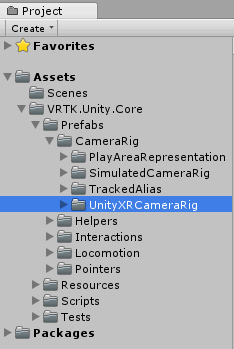

[Home](../../../../README.md) &gt; [How-to Guides](../../README.md) &gt; [Basics](../README.md) &gt; Adding The UnityXRCameraRig

  > Reading time: 2 minutes

### Introduction

The UnityXR CameraRig prefab provides a camera that tracks the HMD rotation and position along with any available XR controllers.

### Useful definitions

* `HMD` - A Head Mounted Display is a display device that is worn on the head, usually a VR/AR Headset.
* `CameraRig` - A GameObject that contains a HMD representation and controller representations.
* `6 degrees of freedom` - An object that is real world tracked in the 3 rotational axes and 3 directional axes, also known as room scale tracking.
* `3 degrees of freedom` - An object that is real world tracked in only the 3 rotational axes and no directional axes, also known as stationary tracking.

### Prerequisites

* Add [VRTK.Unity.Core] to your Unity3d project.

### Step 1

Expand the VRTK.Unity.Core directory in the Unity3d Project window until the `VRTK.Unity.Core -> Prefabs -> CameraRig` directory is visible.

### Step 2

Select the `UnityXRCameraRig` prefab then drag and drop it into the Hierarchy window.

### Step 3

Select the `UnityXRCameraRig` GameObject in the Unity3d Hierarchy window and change the `Unity XR Configuration` component to suit your Tracking Space requirements.

* Ensure the `Tracking Space Type` is set to:
  * `Room Scale` for XR devices that support 6 degrees of freedom tracking (the ability to move around your play area).
  * `Stationary` for XR devices that support 3 degrees of freedom tracking (only the ability to look around but not move within your play area).

### Complete

Now you have a UnityXR CameraRig in your scene. If you play your scene you will see that the game Main Camera is tracking the XR HMD and if there is a connected left and/or right XR controller then they will be tracking the Left/Right Anchors of the UnityXR CameraRig.

### Suggested Reading

* [Using The TrackedAlias With The UnityXRCameraRig](../UsingTheTrackedAliasWithTheUnityXRCameraRig/README.md)

[VRTK.Unity.Core]: https://github.com/ExtendRealityLtd/VRTK.Unity.Core#getting-started