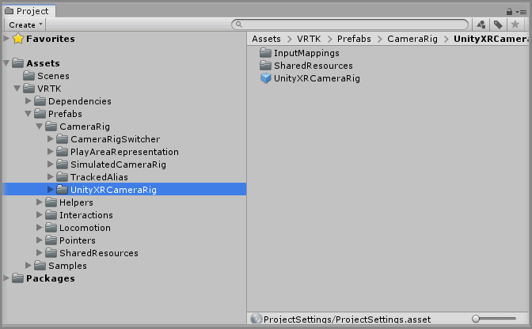

&gt; [Home](../../../../README.md) &gt; [How-to Guides](../../README.md) &gt; [Basics](../README.md)

# Adding The UnityXRCameraRig

> * Level: Beginner
>
> * Reading Time: 2 minutes
>
> * Checked with: Unity 2018.3.6f1

## Introduction

The UnityXR CameraRig helper prefab provides a camera that tracks the HMD rotation and position along with any available XR controllers.

The outcome of this How-To Guide is to learn how to add the UnityXR CameraRig prefab to the scene and configure it for the tracking space type you require.

## Useful definitions

* `HMD` - A Head Mounted Display is a display device that is worn on the head, usually a VR/AR Headset.
* `CameraRig` - A GameObject that contains a HMD representation and controller representations.
* `6 degrees of freedom` - An object that is real world tracked in the 3 rotational axes and 3 directional axes, also known as room scale tracking.
* `3 degrees of freedom` - An object that is real world tracked in only the 3 rotational axes and no directional axes, also known as stationary tracking.

## Prerequisites

* Follow the [VRTK Getting Started] steps to add VRTK to your Unity project.

## Let's Start

### Step 1

Expand the VRTK directory in the Unity Project window until the `VRTK -> Prefabs -> CameraRig -> UnityXRCameraRig` directory is visible and select the `UnityXRCameraRig` directory so the contents are displayed.

### Step 2

Select the `UnityXRCameraRig` prefab then drag and drop it into the Hierarchy window.

Then delete the `Main Camera` GameObject from the Unity Hierarchy window as the `UnityXRCameraRig` contains a Main Camera for the Scene.

### Step 3

Select the `UnityXRCameraRig` GameObject in the Unity Hierarchy window and change the `Unity XR Configuration` component to suit your Tracking Space requirements.

* Ensure the `Tracking Space Type` is set to:
  * `Room Scale` for XR devices that support 6 degrees of freedom tracking (the ability to move around your play area).
  * `Stationary` for XR devices that support 3 degrees of freedom tracking (only the ability to look around but not move within your play area).

### Done

Now you have a UnityXR CameraRig in your scene. If you play the Unity scene you will see that the game Main Camera is tracking the XR HMD and if there is a connected left and/or right XR controller then they will be tracking the Left/Right Anchors of the UnityXR CameraRig.

## Related Reading

* [Adding A TrackedAlias](../AddingATrackedAlias/README.md)

[VRTK Getting Started]: https://github.com/thestonefox/VRTK#getting-started