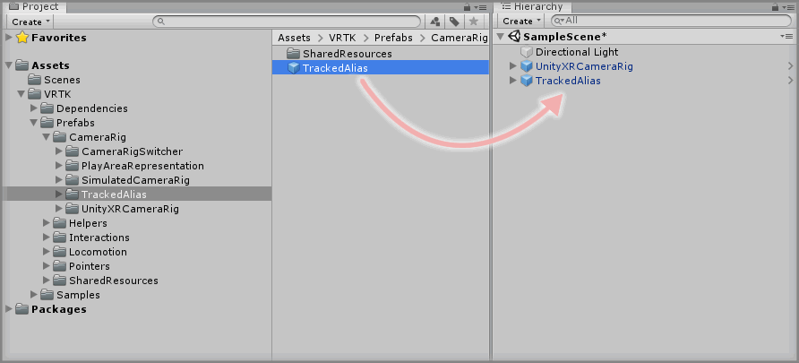
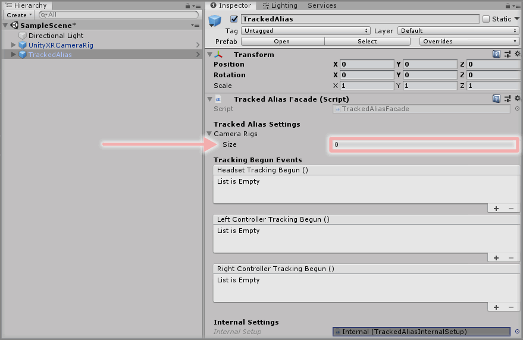
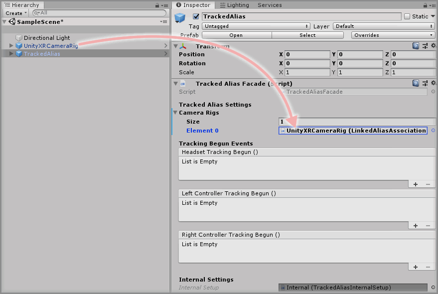
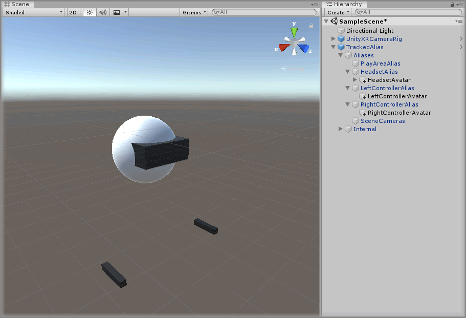

[Home](../../../../README.md) &gt; [How-to Guides](../../README.md) &gt; [Basics](../README.md) &gt; Using The TrackedAlias With The UnityXRCameraRig

  > Reading time: 2 minutes

### Introduction

The TrackedAlias prefab provides a way of attaching elements to camera rigs without specifically tying them to the underlying SDK specific camera rigs.

This is useful if you want to support multiple SDK camera rigs in your scene but don't want to have to duplicate the same child GameObjects to all the relevant camera rigs.

### Useful definitions

* `SDK camera rig` - A prefab from a specific 3rd party plugin (or SDK) that provides the basis for a VR CameraRig setup (e.g. SteamVR or Oculus Utilities).

### Prerequisites

* A UnityXRCameraRig is placed in the scene. See [Adding The UnityXRCameraRig](../AddingTheUnityXRCameraRig/README.md).

### Step 1

Expand the VRTK.Unity.Core directory in the Unity3d Project window until the `VRTK.Unity.Core -> Prefabs -> CameraRig -> TrackedAlias` directory is visible then drag and drop the `TrackedAlias` prefab into the Hierarchy window.

### Step 2

Select the `TrackedAlias` GameObject in the Unity3d Hierarchy window then change the `Tracked Alias Facade` component and increase the `Camera Rigs` size property by 1 (will be 0 by default so make it 1)

### Step 3

Drag the `UnityXRCameraRig` GameObject in the Unity3d Hierarchy window and drop it into the newly displayed `Element` property underneath the `Tracked Alias Facade` component `Camera Rigs` property.

### Complete

Now you have a TrackedAlias in your scene that will track the first active valid CameraRig that is set in the Camera Rigs list. At the moment there is only one CameraRig set so it will only be tracking the UnityXRCameraRig.

You can now place other GameObjects in the TrackedAlias child GameObjects and they will follow the active SDK CameraRig without being specifically tied to it.

### Suggested Reading

* Follow up tutorials coming soon...