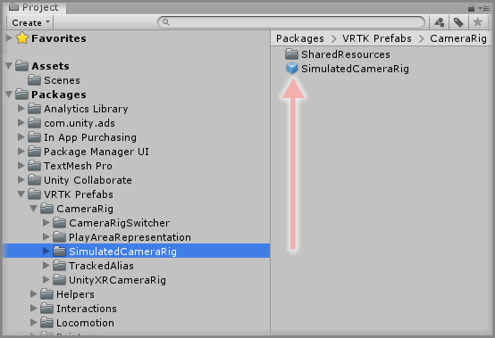
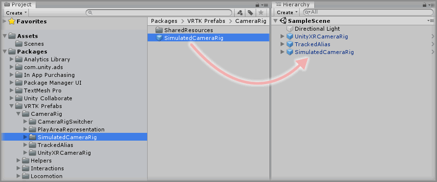
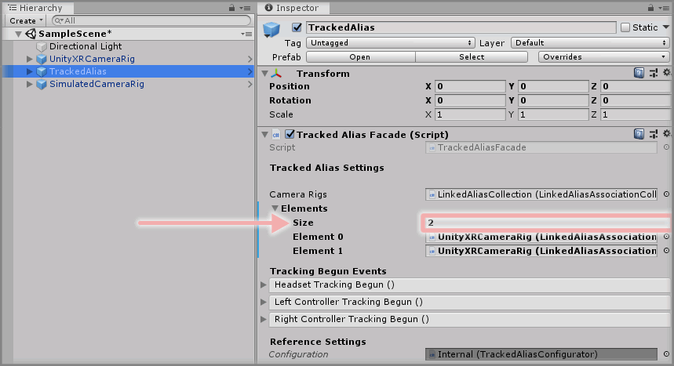
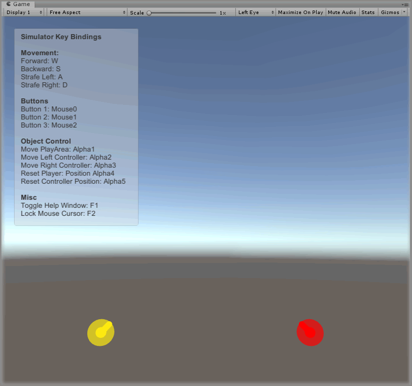

&gt; [Home](../../../../README.md) &gt; [How-to Guides](../../README.md) &gt; [CameraRigs](../README.md)

# Adding The SimulatedCameraRig

> * Level: Beginner
>
> * Reading Time: 5 minutes
>
> * Checked with: Unity 2018.3.10f1

## Introduction

The Simulated CameraRig prefab provides a simulated setup that requires no XR hardware to develop and build with. It creates a pseudo headset and controllers that can be manipulated via the mouse and keyboard, which helps testing and building virtual environments without the need for actual hardware to be plugged in.

The outcome of this guide is to learn how to add the Simulated CameraRig prefab to the scene and configure it along with a TrackedAlias prefab.

## Useful definitions

* `HMD` - A Head Mounted Display is a display device that is worn on the head, usually a VR/AR Headset.
* `CameraRig` - A GameObject that contains a HMD representation and controller representations.
* `Facade` - A facade provides a user friendly interface into a more complex underlying system.

## Prerequisites

* A TrackedAlias is set up in the scene. See [Adding A TrackedAlias](../AddingATrackedAlias/README.md).

## Let's Start

### Step 1

Expand the VRTK directory in the Unity Project window until the `VRTK -> Prefabs -> CameraRig -> SimulatedCameraRig` directory is visible and select the `SimulatedCameraRig` directory so the contents are displayed.

### Step 2

Select the `SimulatedCameraRig` prefab then drag and drop it into the Unity Hierarchy window.

### Step 3

Select the `SimulatedCameraRig` GameObject in the Unity Hierarchy window then drag and drop the `TrackedAlias` GameObject from the Unity Hierarchy window into the `TrackedAlias` parameter on the `Simulator Facade` component.

This will let the Simulator controls move the Tracked Aliases around the scene which represents the pseudo hardware.

### Step 4

Select the `TrackedAlias` GameObject in the Unity Hierarchy window and increase the `Elements -> Size` parameter on the `Linked Alias Association Collection Observable List` component by `1`.

> Note: In this example we'll be setting it to `2` as there is already a `UnityXRCameraRig` in the scene.

### Step 5

Drag and drop the `SimulatedCameraRig` GameObject from the Unity Hierarchy window into the newly displayed `Element 1` field within the `Elements` parameter on the `Linked Alias Association Collection Observable List` component attached to the `TrackedAlias` GameObject.

### Done

Now you have a UnityXR CameraRig in the scene along with a Simulated CameraRig. Only one CameraRig should be enabled in the scene at any one time, so for now disable the `SimulatedCameraRig` GameObject and play the Unity scene.

The scene will start using the UnityXR CameraRig and display via the connected XR hardware, however if you disable the `UnityXRCameraRig` GameObject in the Unity Hierarchy window and then enable the `SimulatedCameraRig` GameObject in the Unity Hierarchy window then the active scene CameraRig will switch to being the Simulated CameraRig.

The `TrackedAlias` prefab will automatically update to use the newly activated CameraRig and allow you to continue playing the scene in the simulated mode.

## Related Reading

* [Creating Proxy Actions And Chaining Actions](../../Actions/CreatingProxyActionsAndChainingActions/README.md)