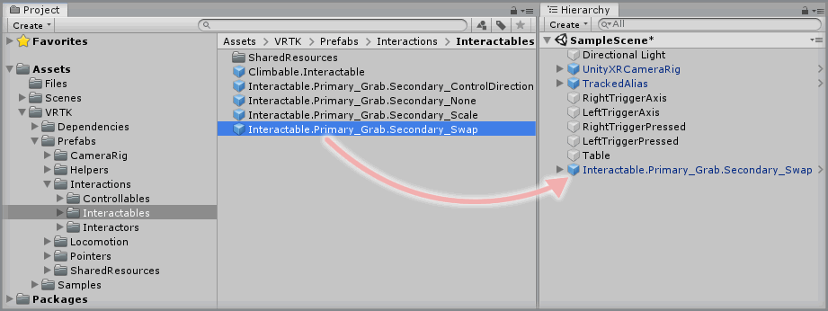
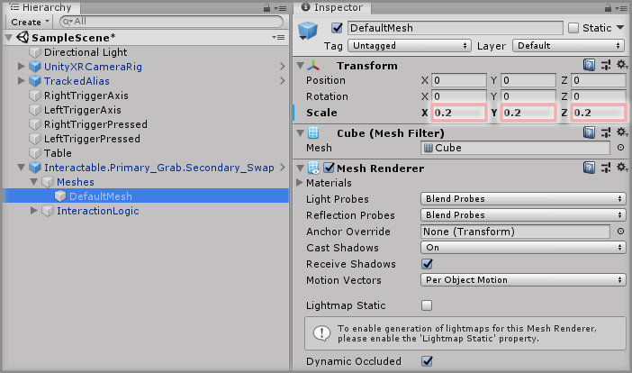
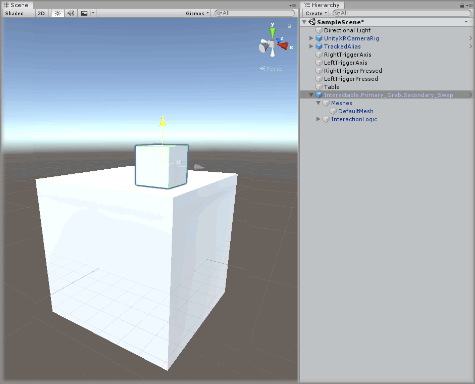
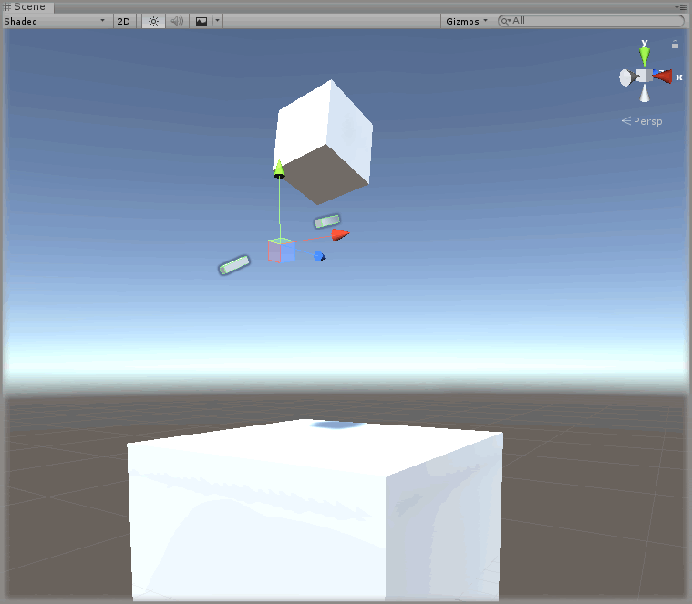

&gt; [Home](../../../../README.md) &gt; [How-to Guides](../../README.md) &gt; [Interactions](../README.md)

# Adding An Interactable

> * Level: Beginner
>
> * Reading Time: 10 minutes
>
> * Checked with: Unity 2018.3.6f1

## Introduction

An `Interactable` prefab provides GameObject that can be interacted with in the virtual world via an `Interactor` prefab. Interactable GameObjects can be notified of actions that the Interactor is performing such as being touched by an Interactor or reacting to actions such as a grab button being pressed.

There are a number of different `Interactable` prefabs on offer, but for this example we'll focus on setting up the `Interactable.Primary_Grab.Secondary_Swap` prefab, which is the most common use case for an Interactable GameObject.

By default, Interactable GameObjects can usually perform two actions depending on which Interactor is acting upon them. A common use case is a scene with a Left and Right Controller, both capable of grabbing the Interactable GameObject and carrying it in some way, the first grab attempt from an Interactor is called the `Primary Grab Action` and whilst this is occurring any second grab attempt from a different Interactor is called the `Secondary Grab Action`.

This guide will show how to set up an `Interactable` prefab that we can grab with either of our controllers and when we grab it with the other controller, the Interactable GameObject will swap hands as if we had passed the GameObject between our virtual hands.

## Useful definitions

* `Touch` - The concept of where an Interactor is physically colliding with a valid interactable object.
* `Grab` - The concept of where an Interactor can be actioned to notify a valid touching interactable object that the Interactor wants to initiate the interactable object's grab functionality.
* `Rigidbody` - A Unity component that allows a GameObject to be affected by the Unity Physics system. Forces (such as gravity) can be applied to the GameObject.
* `Mesh` - A collection of triangles arranged in 3D space to represent a 3D shape.

## Prerequisites

* An `Interactor` prefab is set up in the scene. See [Adding An Interactor](../AddingAnInteractor/README.md).

## Let's Start

### Step 1

Before we begin adding the `Interactable` prefab to the scene, let's create a simple surface that the `Interactable` prefab will rest on as Interactable GameObjects have a `Rigidbody` component which means they are affected by the gravity in our virtual world. If an `Interactable` prefab was added to a blank scene then when the scene was played it would just fall infinitely as the virtual world gravity would apply to it and pull it down until it collided with a solid surface.

Create a new `Cube` Unity 3D Object by selecting `Main Menu -> GameObject -> 3D Object -> Cube` then rename the GameObject to `Table`.

> Note: You may need to change the `Table` GameObject properties so it is positioned in a place where it is easy to reach and grab the `Interactable` prefab we're about to add.

### Step 2

Expand the VRTK directory in the Unity Project window until the `VRTK -> Prefabs -> Interactions -> Interactables` directory is visible then drag and drop the `Interactable.Primary_Grab.Secondary_Swap` prefab into the Unity Hierarchy window.

### Step 3

We're going to change the look of the `Interactable.Primary_Grab.Secondary_Swap` GameObject as by default it's just a `1 x 1 x 1` Cube, which will be very big in our virtual world.

Expand the `Interactable.Primary_Grab.Secondary_Swap` GameObject in the Unity Hierarchy window until the `Meshes -> DefaultMesh` GameObject is visible. We can add a new mesh or collection of meshes under the `Meshes` GameObject and simply set the `Meshes -> DefaultMesh` GameObject to inactive to hide it from the scene, or we can simply change the parameters on the components found on the `Meshes -> DefaultMesh` GameObject.

For this example, we'll just change the `Meshes -> DefaultMesh` to reduce the size of the cube. With the `Meshes -> DefaultMesh` GameObject selected, change the `Transform` component properties to:

* Scale: `X = 0.2`, `Y = 0.2`, `Z = 0.2`

### Step 4

Let's move the `Interactable` GameObject so it's resting on top of the `Table` GameObject in the scene. When moving an `Interactable` prefab make sure not to move the internal meshes and instead move the `Interactable` prefab GameObject that was dragged into the Unity Hierarchy window.

Select the `Interactable.Primary_Grab.Secondary_Swap` GameObject in the Unity Hierarchy window and adjust the `Transform` component properties so the `Interactable` GameObject is resting on top of the `Table` GameObject.

> Note: You don't have to be pixel perfect with the positioning, if the `Interactable` GameObject is too high then gravity will make it fall down on top of the table and if it is slightly intersecting with the table, then the Unity Physics system will resolve the collision and push the `Interactable` GameObject up a bit until it is resting normally on the table.

### Done

Play the Unity scene and touch the `Interactable.Primary_Grab.Secondary_Swap` GameObject with either the Left or Right Controller. The Interactors on the touching Controller will tell the `Interactable` GameObject that it is being touched and then pressing the Trigger down on the Controller will initiate the Grab Action and make the `Interactable` GameObject follow our grabbing Controller around.

You can grab the `Interactable` GameObject with the other Controller to swap the grab to the other hand and you can also throw the `Interactable` GameObject and release the Trigger to apply the Controller velocity which will throw the `Interactable` GameObject.

## Related Reading

* Coming Soon...