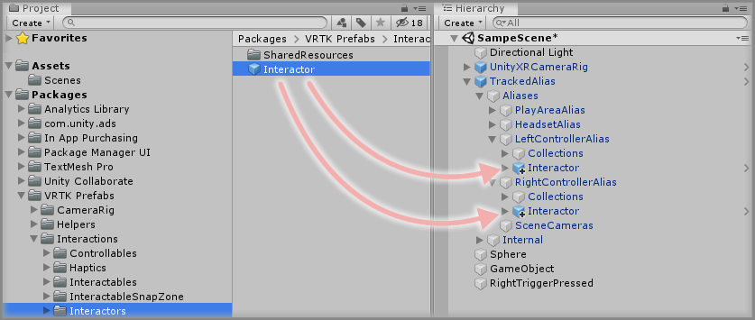
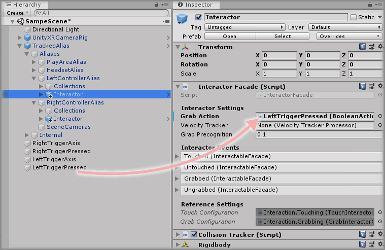
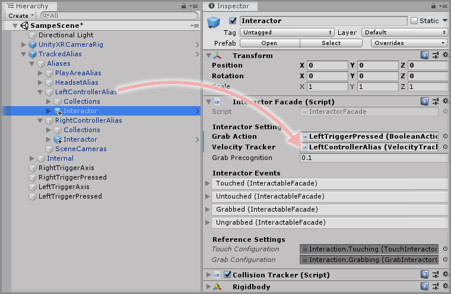

&gt; [Home](../../../../README.md) &gt; [How-to Guides](../../README.md) &gt; [Interactions](../README.md)

# Adding An Interactor

> * Level: Beginner
>
> * Reading Time: 10 minutes
>
> * Checked with: Unity 2018.3.10f1

## Introduction

The first step into interacting with virtual objects is to define an interactor, which is a concept of something that knows when it is touching an interactable object as well as being able to grab the object to affect it in some way.

The Interactor prefab can be added to any GameObject that we want to be able to touch and grab interactable objects. In this guide we'll look at making the virtual controllers work as interactors so we can simulate picking up virtual objects with our virtual hands.

## Useful definitions

* `Touch` - The concept of where an Interactor is physically colliding with a valid interactable object.
* `Grab` - The concept of where an Interactor can be actioned to notify a valid touching interactable object that the Interactor wants to initiate the interactable object's grab functionality.

## Prerequisites

* A TrackedAlias is set up in the scene. See [Adding A TrackedAlias](../../CameraRigs/AddingATrackedAlias/README.md).
* A `Boolean Action` is defined in the scene that we can use to initiate the grab. See [Converting A Float Action To A Boolean Action](../../Actions/ConvertingAFloatActionToABooleanAction/README.md)

## Let's Start

### Step 1

The `Interactor` prefab comes with an `ExampleAvatar` GameObject, which provides a basic representation of the Interactor containing a simple cube mesh and a simple cube collider. These can be changed to suit whatever purpose you may have, but for this example, we'll keep the `ExampleAvatar` GameObject untouched.

> Note: If you followed the [Adding A TrackedAlias](../../CameraRigs/AddingATrackedAlias/README.md) guide and added in custom GameObjects for controller avatars, you can delete them now as the `ExampleAvatar` GameObject will provide us with a basic controller avatar instead. This guide is based off the scene created in [Converting A Float Action To A Boolean Action](../../Actions/ConvertingAFloatActionToABooleanAction/README.md).

Expand the VRTK directory in the Unity Project window until the `VRTK -> Prefabs -> Interactions -> Interactors` directory is visible. For this example, we're going to add the Interactor prefab to our controller aliases within our TrackedAlias prefab, so expand the TrackedAlias prefab in the Unity Hierarchy window until the `LeftControllerAlias` and `RightControllerAlias` GameObjects are visible.

Drag and drop the `Interactor` prefab to be a child of the `LeftControllerAlias` then drag and drop another `Interactor` prefab to be a child of the `RightControllerAlias`.

> Note: The following steps will be carried out on both the `LeftControllerAlias` and the `RightControllerAlias` but the instructions will only outline the steps once, so be sure to carry them out for both controller aliases.

### Step 2

Select the `Interactor` prefab in the Unity Hierarchy under the `LeftControllerAlias` GameObject and change the `Interactor Facade` component to configure the base functionality of the Interactor.

We need to specify an action that initiates the Interactor's Grab notification. The `Grab Action` parameter on the `Interactor Facade` allows us to provide a `Boolean Action` to initiate the Grab function of the Interactor.

In the [Converting A Float Action To A Boolean Action](../../Actions/ConvertingAFloatActionToABooleanAction/README.md) guide, we learned how to convert a controller axis value to a boolean value so we can initiate actions such as grabbing when a controller axis reaches a certain limit. This is ideal, as for this example we'll set up pressing the trigger axis down on the controller will initiate the Grab action.

There is already a `RightTriggerPressed` GameObject in the Unity Hierarchy window that will give us a `Boolean Action` for the Right Controller Trigger axis. We need to create the same concept but for the Left Controller Trigger axis. This `RightTriggerPressed` action sequence is initiated by the `Unity Axis 1D Action` component found within our scene on the GameObject named `GameObject`. Let's rename this to make it a bit easier to understand, so rename the `GameObject` GameObject to `RightTriggerAxis`. Let's also remove the `Opacity Changer` component from our newly named `RightTriggerAxis` GameObject as this won't be needed anymore. Finally, let's delete the `Sphere` GameObject as that isn't needed either.

> Challenge: Can you set up a `LeftTriggerPressed` GameObject in the Unity scene that allows us to get a `Boolean Action` out of when the Left Controller Trigger axis is squeezed by at least 75%? Use the [Converting A Float Action To A Boolean Action](../../Actions/ConvertingAFloatActionToABooleanAction/README.md) guide for help. It is now helpful to rename the `GameObject` GameObject in the Unity Hierarchy to something more descriptive, such as `RightTriggerAxis` as the role of that GameObject is to report the axis values from the Right Controller Trigger.

Now we should have a `LeftTriggerPressed` GameObject in the Unity Hierarchy window and we can drag and drop this `LeftTriggerPressed` GameObject into the `Grab Action` parameter on the `Interactor Facade` component.

> Note: The `LeftTriggerPressed` GameObject contains multiple components, but the Unity software knows that the `Grab Action` parameter is of type `Boolean Action` so it sets it to the `Boolean Action` found on the injected GameObject.

> Note: Be sure to do the same with the `RightTriggerPressed` GameObject and the `RightControllerAlias -> Interactor` prefab.

### Step 3

When an Interactor grabs an interactable object, it is usually required that the velocity that the Interactor is moving at can be applied to the interactable object. For example, if we were to pick up an interactable object and throw it, then we would want the velocity that we're moving our virtual controller at to be applied to the interactable object so we can control the power of the throw.

The `Velocity Tracker` parameter on the `Interactor Facade` component allows us to specify a velocity tracking component that will provide the relevant velocity data. Fortunately, our `TrackedAlias` prefab already comes with the relevant `Velocity Tracker` components on the relevant aliases that can move freely in the virtual world such as the Headset, Left Controller and Right Controller.

Drag and drop the `TrackedAlias -> Aliases -> LeftControllerAlias` GameObject into the `Velocity Tracker` parameter on the `Interactor Facade` to set the interactor to track velocities from our Left Controller.

> Note: Be sure to do the same with the `RightControllerAlias` GameObject and the `RightControllerAlias -> Interactor` prefab.

### Done

We now have an `Interactor` prefab attached to our `TrackedAlias -> LeftControllerAlias` and our `TrackedAlias -> RightControllerAlias` and Interactors will follow the Alias GameObjects as are children of the GameObjects in the Unity Hierarchy. At the moment, these Interactors won't do anything special in our scene because there is nothing to interact with.

## Related Reading

* [Adding An Interactable](../AddingAnInteractable/README.md)
