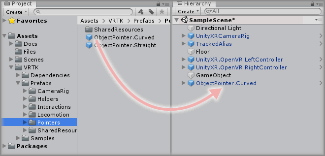
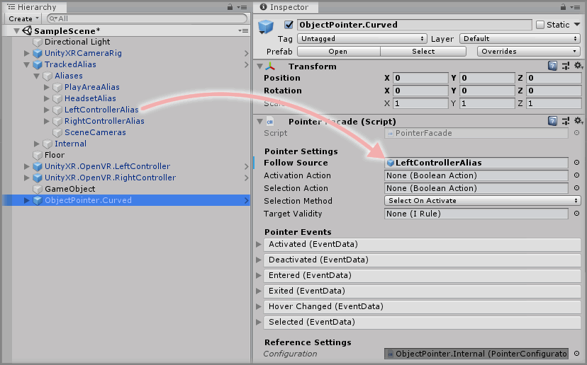
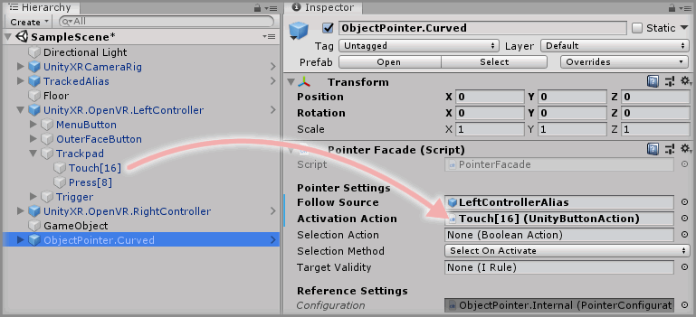
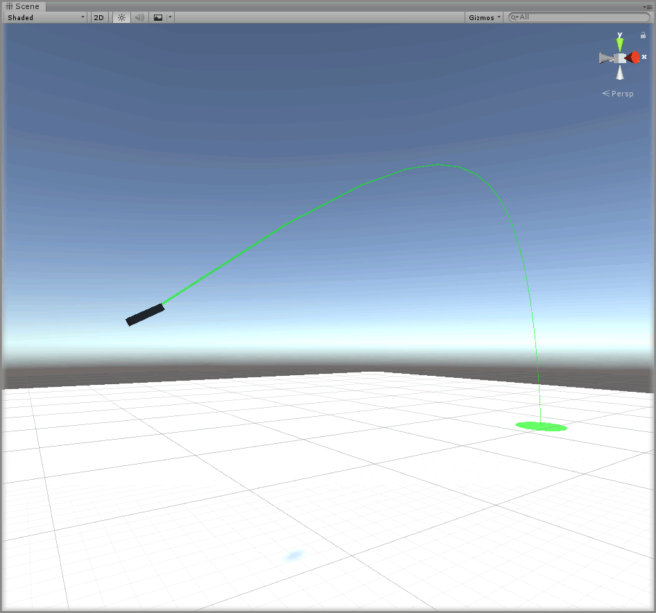

&gt; [Home](../../../../README.md) &gt; [How-to Guides](../../README.md) &gt; [Pointers](../README.md)

# Adding A Curved Pointer

> * Level: Beginner
>
> * Reading Time: 5 minutes
>
> * Checked with: Unity 2018.3.10f1

## Introduction

The Curved Pointer (also known as a Bezier or Parabolic Pointer) casts a curved line from an origin point forward a certain distance and then down until it collides with a collider. The representation of this forward and then downward cast is represented with a bezier curve, which basically plots a curved line between the origin of the beam and the final target point.

When a Curved Pointer is colliding with a valid GameObject, a Selection Action can occur which emits an event containing data about the GameObject that the Curved Pointer is currently colliding with.

The Curved Pointer is a popular choice when creating a teleport locomotion feature as the curved beam always lands on the floor making it easier to choose a destination location.

## Useful definitions

* `OpenVR Controller` - A virtual reality based controller that works with the OpenVR standard such as a HTC Vive wand or Oculus Touch controller via SteamVR.
* `Trackpad` - The touchpad/thumbstick of an OpenVR Controller.
* `Facade` - A facade provides a user friendly interface into a more complex underlying system.

## Prerequisites

* A Unity Button Action exists in the scene. See [Adding A Unity Button Action](../../Actions/AddingAUnityButtonAction/README.md).

## Let's Start

### Step 1

Expand the VRTK directory in the Unity Project window until the `VRTK -> Prefabs -> Pointers` directory is visible then drag and drop the `ObjectPointer.Curved` prefab into the Hierarchy window.

### Step 2

Select the `ObjectPointer.Curved` prefab in the Unity Hierarchy and change the `Pointer Facade` component to configure the base functionality of the Pointer.

The `Follow Source` parameter determines what GameObject the Pointer should track in the scene, for example, if we want the Pointer to follow around the Left Controller GameObject then drag and drop the `TrackedAlias -> Aliases -> LeftControllerAlias` GameObject into the `Follow Source` parameter on the `Pointer Facade` component.

### Step 3

The Curved Pointer will be deactivated by default so we need a way of activating and deactivating the Pointer beam. This is done by hooking up a `BooleanAction` that when becomes `true` will activate the Pointer and when becomes `false` will deactivate the Pointer.

Any `BooleanAction` can be used to perform this activation/deactivation but in this instance we're going to use the touch state of the Trackpad of our OpenVR Controller, so when the Trackpad is touched then the Pointer will activate and when the Trackpad is no longer being touched then the Pointer will deactivate.

We should already have a `Unity Button Action` in the scene that handles the touch state of the Trackpad of an OpenVR Controller so expand the `UnityXR.OpenVR.LeftController -> Trackpad` GameObject in the Unity Hierarchy to expose the `Touch[16]` GameObject. This `Touch[16]` GameObject contains the `Unity Button Action` that listens for the touch state of the Trackpad on the Left OpenVR Controller.

Drag and drop the `UnityXR.OpenVR.LeftController -> Trackpad -> Touch[16]` GameObject into the `Activation Action` parameter on the `Pointer Facade` component.

### Done

We won't use any of the other `Pointer Facade` parameters for now as we have all we need for a Curved Pointer to be activated on Trackpad touch and it will cast in whatever direction the Left Controller is pointing and curve down to the nearest floor surface for the final target destination.

Play the Unity scene and touch the Trackpad on the Left Controller and the Curved Pointer will emit a beam from the controller pointing in the forward direction of the controller and find the floor as a target. Notice how the Curved Pointer beam has two states when it is activated:

* Valid Collision - The Curved Pointer is colliding with a valid GameObject and displays as a green curved line.
* Invalid/No Collision - The Curved Pointer is not colliding with any valid GameObject and displays as a red curved line.

## Related Reading

* [Adding A Straight Pointer](../AddingAStraightPointer/README.md)
* [Adding A Teleporter](../../Locomotion/AddingATeleporter/README.md)