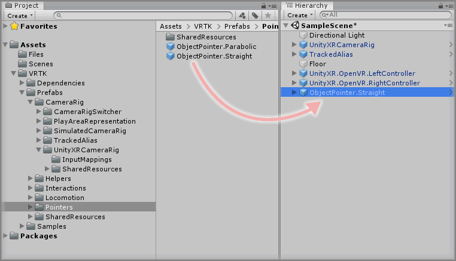
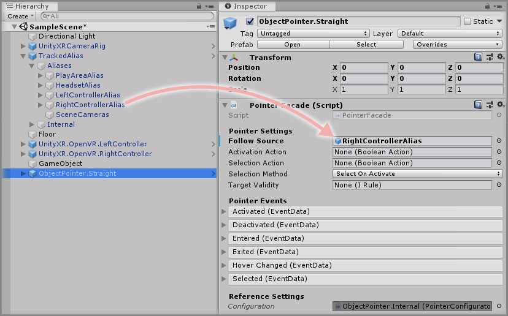
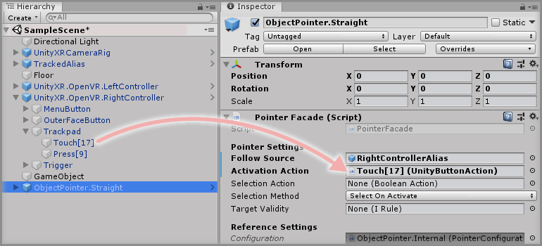
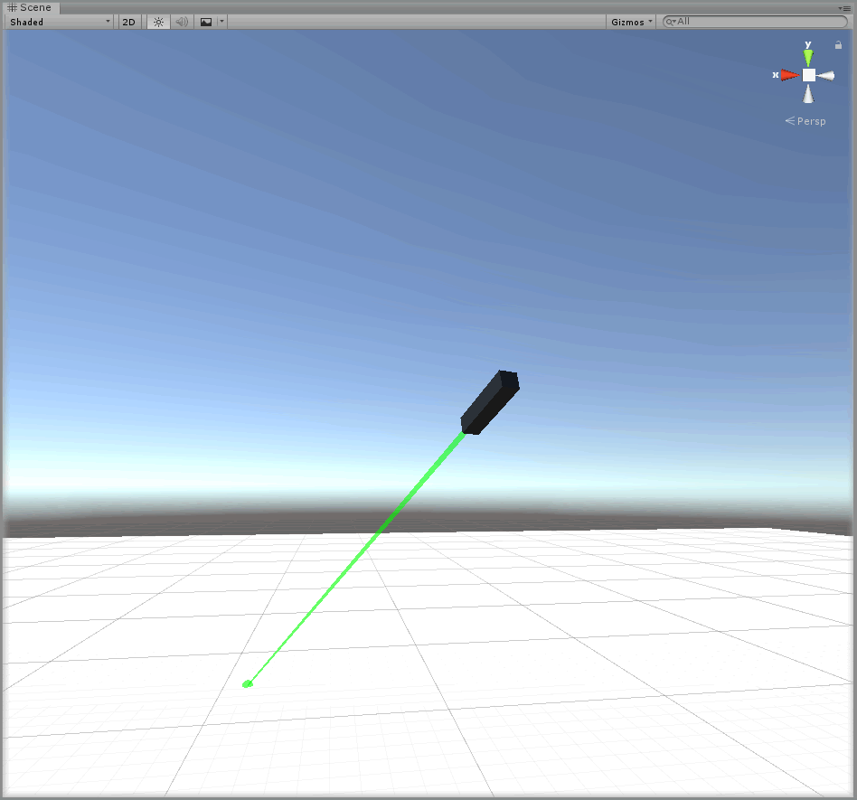

&gt; [Home](../../../../README.md) &gt; [How-to Guides](../../README.md) &gt; [Pointers](../README.md)

# Adding A Straight Pointer

> * Level: Beginner
>
> * Reading Time: 5 minutes
>
> * Checked with: Unity 2018.3.10f1

## Introduction

The Straight Pointer prefab casts a straight line from an origin point to the maximum specified length or until the Pointer beam collides with a valid target.

When a Straight Pointer is colliding with a valid GameObject, a Selection Action can occur which emits an event containing data about the GameObject that the Straight Pointer is currently colliding with.

A Straight Pointer is useful for picking out a location with precision especially when attached to a controller. We'll set up a Straight Pointer on a controller that can be activated and deactivated when the Trackpad on an OpenVR Controller is touched and untouched.

## Useful definitions

* `OpenVR Controller` - A virtual reality based controller that works with the OpenVR standard such as a HTC Vive wand or Oculus Touch controller via SteamVR.
* `Trackpad` - The touchpad/thumbstick of an OpenVR Controller.
* `Facade` - A facade provides a user friendly interface into a more complex underlying system.

## Prerequisites

* A Unity Button Action exists in the scene. See [Adding A Unity Button Action](../../Actions/AddingAUnityButtonAction/README.md).

## Let's Start

### Step 1

Expand the VRTK Prefabs Package directory in the Unity Project window until the `Packages -> VRTK Prefabs -> Pointers` directory is visible then drag and drop the `ObjectPointer.Straight` prefab into the Hierarchy window.

### Step 2

Select the `ObjectPointer.Straight` prefab in the Unity Hierarchy and change the `Pointer Facade` component to configure the base functionality of the Pointer.

The `Follow Source` parameter determines what GameObject the Pointer should track in the scene, for example, if we want the Pointer to follow around the Right Controller GameObject then drag and drop the `TrackedAlias -> Aliases -> RightControllerAlias` GameObject into the `Follow Source` parameter on the `Pointer Facade` component.

### Step 3

The Straight Pointer will be deactivated by default so we need a way of activating and deactivating the Pointer beam. This is done by hooking up a `BooleanAction` that when becomes `true` will activate the Pointer and when becomes `false` will deactivate the Pointer.

Any `BooleanAction` can be used to perform this activation/deactivation but in this instance we're going to use the touch state of the Trackpad of our OpenVR Controller, so when the Trackpad is touched then the Pointer will activate and when the Trackpad is no longer being touched then the Pointer will deactivate.

We should already have a `Unity Button Action` in the scene that handles the touch state of the Trackpad of an OpenVR Controller so expand the `UnityXR.OpenVR.RightController -> Trackpad` GameObject in the Unity Hierarchy to expose the `Touch[17]` GameObject. This `Touch[17]` GameObject contains the `Unity Button Action` that listens for the touch state of the Trackpad on the Right OpenVR Controller.

Drag and drop the `UnityXR.OpenVR.RightController -> Trackpad -> Touch[17]` GameObject into the `Activation Action` parameter on the `Pointer Facade` component.

### Done

We won't use any of the other `Pointer Facade` parameters for now as we have all we need for a Straight Pointer to be activated on Trackpad touch and it will point in a straight line in whatever direction the Right Controller is pointing.

Play the Unity scene and touch the Trackpad on the Right Controller and the Straight Pointer will emit a beam from the controller pointing in the forward direction of the controller. Notice how the Straight Pointer beam has two states when it is activated:

* Valid Collision - The Straight Pointer is colliding with a valid GameObject and displays as a green line.
* Invalid/No Collision - The Straight Pointer is not colliding with any valid GameObject and displays as a red line.

## Related Reading

* [Adding A Curved Pointer](../AddingACurvedPointer/README.md)
* [Adding A Teleporter](../../Locomotion/AddingATeleporter/README.md)