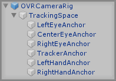
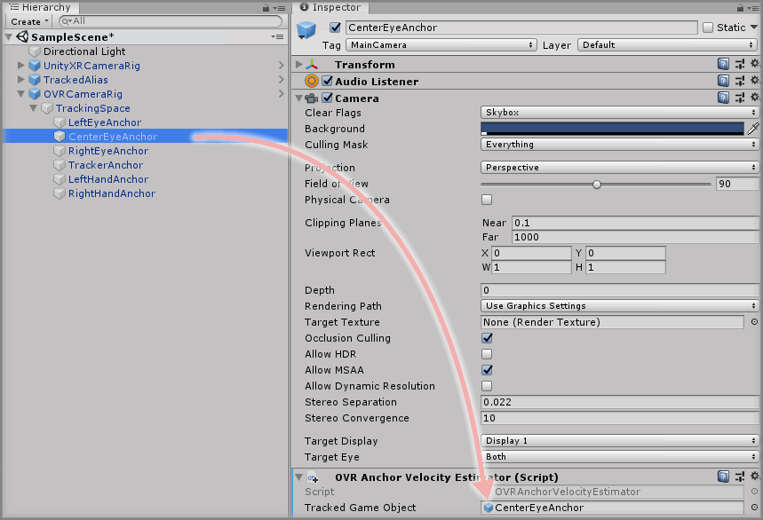
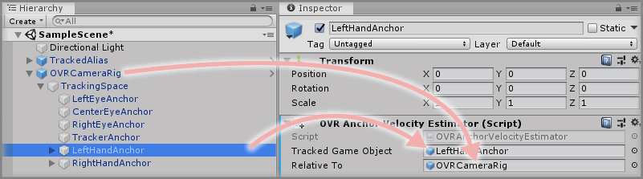
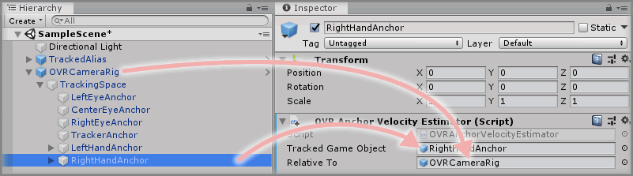
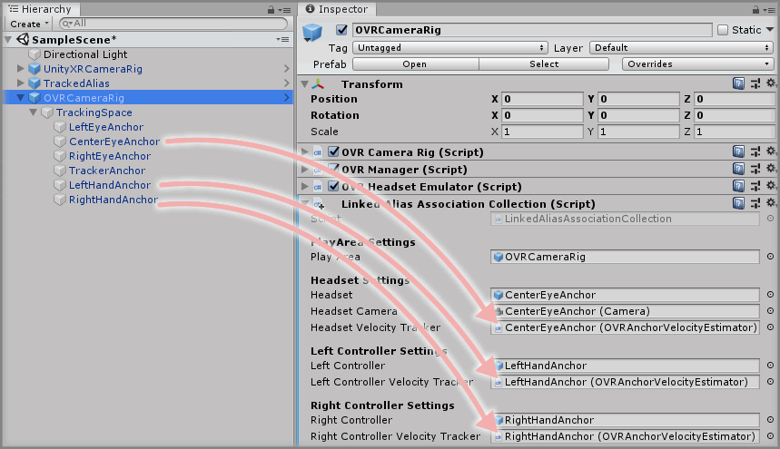

&gt; [Home](../../../../../README.md) &gt; [Tutorials](../../../README.md) &gt; [Working With 3rd Party SDKs](../../README.md) &gt; [Using Oculus Integration](../README.md)


# Creating An OVR Velocity Tracker

> * Level: Intermediate
>
> * Reading Time: 20 minutes
>
> * Checked with: Unity 2018.3.10f1 and Oculus Integration 1.35

## Introduction

The Oculus Integration SDK provides velocity and angular velocity data from the `OVRPlugin` and `OVRInput` part of the SDK. It's possible to create a simple script to wrap this data and utilize it within VRTK for reporting velocities. Getting the velocity and angular velocity of a tracked device is essential for things like throwing objects as the speed and direction in which the controller is moving can be converted into the power to throw the object at.

All of the code in this section can be found at https://github.com/ExtendRealityLtd/VRTK.Tutorials.OculusIntegration/blob/master/Runtime/Tracking/Velocity

## Useful definitions

* `Velocity` - The speed at which an object is moving in a certain direction.
* `Angular Velocity` - The speed in which an object is rotating around a certain axis.
* `Zinnia` - A library containing a collection of reusable software design patterns for use with the Unity software.
* `Namespace` - A C# namespace is used to organize classes into distinct groups so duplicate definitions do not cause conflicts.

## Prerequisites

* An `OVRCameraRig` is set up in the scene. See [Working With The OVRCameraRig](../WorkingWithTheOVRCameraRig/README.md).

## Let's Start

### Step 1

Zinnia provides an abstract class for tracking velocities so for us to access the velocity data within the `OVRPlugin` and `OVRInput` we're going to need a small script that adheres to the code contract in the `Zinnia.VelocityTracker` whilst calling the relevant methods on the `OVRPlugin` and `OVRInput`.

Create a new `C# Script` and name it `OVRAnchorVelocityEstimator` as this script will be responsible for estimating velocities for a given `OVRAnchor` GameObject.

> [see commit #4224256](https://github.com/ExtendRealityLtd/VRTK.Tutorials.OculusIntegration/commit/42242567d2355d24cdbf4267a1415b0350ddf333)

### Step 2

Open the newly created `OVRAnchorVelocityEstimator` script. The Unity Software creates the default body for the script so right now it should look like this:

```
using System.Collections;
using System.Collections.Generic;
using UnityEngine;

public class OVRAnchorVelocityEstimator : MonoBehaviour
{
  // Start is called before the first frame update
  void Start()
  {

  }

  // Update is called once per frame
  void Update()
  {

  }
}
```

We don't actually need most of that default code so delete the relevant lines so the code is at the following clean starting point:

```
using UnityEngine;

public class OVRAnchorVelocityEstimator : MonoBehaviour
{
}
```

> [see commit #baae22b](https://github.com/ExtendRealityLtd/VRTK.Tutorials.OculusIntegration/commit/baae22ba0685db569a13b53e0ee22ab7319bae33)

### Step 3

First thing we should do is wrap our class in a namespace to prevent any definitions we make such as the class name causing conflicts with duplicate class names elsewhere in the code base.

It's best practice to use the directory structure as the basis of the namespace so in the `Assets` directory create a new nested set of directories as such:
`Tracking/Velocity/` and move the `OVRAnchorVelocityEstimator.cs` file inside that directory. Our namespace can then become the name of our project followed by the directory structure our script is found in. i.e.:

`OculusIntegrationForVRTK.Tracking.Velocity`

So to add that namespace to our code, we simply wrap the class with a namespace block, like so:

```
namespace OculusIntegrationForVRTK.Tracking.Velocity
{
  using UnityEngine;

  public class OVRAnchorVelocityEstimator : MonoBehaviour
  {
  }
}
```

> [see commit #d18594c](https://github.com/ExtendRealityLtd/VRTK.Tutorials.OculusIntegration/commit/d18594c4a8e76853d88edeeb0d367f372451d8f1)

### Step 4

Currently the class extends the [MonoBehaviour](https://docs.unity3d.com/ScriptReference/MonoBehaviour.html) component. However, we want our component to be a Zinnia Velocity Tracker so we can obtain the velocity data any VRTK component requires to function. To extend the Zinnia Velocity Tracker, we simply need to include the relevant Zinnia Velocity Tracking library in our class and make sure we extend it.

```
namespace OculusIntegrationForVRTK.Tracking.Velocity
{
  using UnityEngine;
  using Zinnia.Tracking.Velocity;

  public class OVRAnchorVelocityEstimator : VelocityTracker
  {
  }
}
```

We're not quite done yet though, we will now have errors in the code because `VelocityTracker` is our base class.

> Errors:
> `OVRAnchorVelocityEstimator` does not implement inherited abstract class member `VelocityTracker.DoGetVelocity()`
> `OVRAnchorVelocityEstimator` does not implement inherited abstract class member `VelocityTracker.DoGetAnuglarVelocity()`

This is because the Zinnia Velocity Tracker describes a contract defining the definitions we must make in our class to make it compatible with any other component that utilizes the velocity data.

For now, let's just add the definitions required to make the errors go away. Although, our component won't function correctly until we add some actual useful code.

```
namespace OculusIntegrationForVRTK.Tracking.Velocity
{
  using UnityEngine;
  using Zinnia.Tracking.Velocity;

  public class OVRAnchorVelocityEstimator : VelocityTracker
  {
    protected override Vector3 DoGetAngularVelocity()
    {
      throw new System.NotImplementedException();
    }

    protected override Vector3 DoGetVelocity()
    {
      throw new System.NotImplementedException();
    }
  }
}
```

> [see commit #56866a1](https://github.com/ExtendRealityLtd/VRTK.Tutorials.OculusIntegration/commit/56866a14bbd283547a3a90867dd77ad6f9173597)

### Step 5

We can see our default method implementations tell us about the sort of data they expect to return.

* `DoGetVelocity` returns a `Vector3` which should return the current tracked velocity in a `Vector3` data type.
* `DoGetAngularVelocity` returns a `Vector3` which should return the current tracked angular velocity in a `Vector3` data type.

So to get this information out of the `OVRPlugin` and `OVRInput` we're going to need to add code to these methods to extract the data we require and return it into a format that VRTK can use.

The `OVRCameraRig` defines it's tracked objects as `Anchors` and as can be seen in the `OVRCameraRig` hierarchy.



The Oculus Integration SDK provides two mechanisms for obtaining velocity data from these anchor GameObjects. The `OVRPlugin` will provide velocity data on the Headset anchor and the `OVRInput` will provide velocity data for the controller anchors.

We want to make our Velocity Tracker component reusable so instead of hard coding values straight into the script, we'll create a public parameter that will let us inject the anchor GameObject into our component via the Unity Inspector, then this injected GameObject will be used to report velocities on.

Let's create a public field in our script so we can inject a GameObject to utilize when getting tracked velocities.

```
namespace OculusIntegrationForVRTK.Tracking.Velocity
{
  using UnityEngine;
  using Zinnia.Tracking.Velocity;

  public class OVRAnchorVelocityEstimator : VelocityTracker
  {
    [Tooltip("The GameObject anchor from the OVRCameraRig to track velocity for.")]
    public GameObject trackedGameObject;

    protected override Vector3 DoGetAngularVelocity()
    {
      throw new System.NotImplementedException();
    }

    protected override Vector3 DoGetVelocity()
    {
      throw new System.NotImplementedException();
    }
  }
}
```

Our public field will show in the Unity Inspector when we add our `OVRAnchorVelocityEstimator` component to a GameObject in the scene, so it's helpful to use the `[Tooltip]` attribute to describe what this field is actually offering the user.

> [see commit #446dbc6](https://github.com/ExtendRealityLtd/VRTK.Tutorials.OculusIntegration/commit/446dbc67ad763f4df9647639ef46b60cdd7b5a76)

### Step 6

Now we can inject a GameObject into our script we can use this to determine what GameObject we want to report velocity data for. As the Oculus Integration SDK doesn't provide us any specific way of obtaining velocity data based on the anchor GameObjects this means we're going to have to do some simple GameObject name matching to work out our logic for us.

Let's start with the `DoGetVelocity` method and add some logic to report on the velocity for our injected `trackedGameObject` parameter.

First we need a switch statement to determine different logic paths based on the name of the injected `trackedGameObject`.

```
protected override Vector3 DoGetVelocity()
{
  switch (trackedGameObject.name)
  {
  }
}
```

We know there are three anchors in the `OVRCameraRig` hierarchy that we're interested in tracking velocity on:

* `CenterEyeAnchor` represents the HMD.
* `LeftHandAnchor` represents the left controller.
* `RightHandAnchor` represents the right controller.

So let's update the switch statement with logic cases for each of these names.

```
protected override Vector3 DoGetVelocity()
{
  switch (trackedGameObject.name)
  {
    case "CenterEyeAnchor":
    case "LeftHandAnchor":
    case "RightHandAnchor":
  }
}
```

Each `case` block will only execute if the `trackedGameObject` name matches the string in the case check. So for example, if we had dragged and dropped the `OVRCameraRig -> Tracking Space -> CenterEyeAnchor` GameObject into the `trackedGameObject` parameter on the `OVRAnchorVelocityEstimator` component, then the first case check will be true and therefore execute the code in there.

> Note: At the moment all of the code in the switch statement would actually execute as there is nothing telling the case blocks to not carry on when they have been completely, this is usually resolved by adding a `break` command or returning something from the case block so the code can no longer continue it's execution path.

We need to add some logic now for actually getting the velocity of the injected `trackedGameObject`.

If the `trackedGameObject` is the `CenterEyeAnchor` then we need to use the `OVRPlugin.GetNodeVelocity` method which reports the velocities on the given node, which we can provide as being the Headset node.

```
protected override Vector3 DoGetVelocity()
{
  switch (trackedGameObject.name)
  {
    case "CenterEyeAnchor":
      return OVRManager.isHmdPresent ? OVRPlugin.GetNodeVelocity(OVRPlugin.Node.EyeCenter, OVRPlugin.Step.Render).FromFlippedZVector3f() : Vector3.zero;
    case "LeftHandAnchor":
      return Vector3.zero;
    case "RightHandAnchor":
      return Vector3.zero;
  }
  return Vector3.zero;
}
```

As can be seen from the code above, the `CenterEyeAnchor` case now returns the velocity data for the `EyeCenter` node which is obtained from the `OVRPlugin.GetNodeVelocity` method.

We're also just returning a `Vector3` of zero for the `LeftHandAnchor` and the `RightHandAnchor` just so the code compiles as the case statement needs a return point. We also simply return a `Vector3` of zero if the injected `trackedGameObject` does not match any of the names we are checking for as we don't want any velocity data for GameObjects that aren't supported.

Let's break down this line a bit more as it's doing more than just that:

`return OVRManager.isHmdPresent ? OVRPlugin.GetNodeVelocity(OVRPlugin.Node.EyeCenter, OVRPlugin.Step.Render).FromFlippedZVector3f() : Vector3.zero;`

* `return` - Returns the Vector3 data obtained from the method back to whatever is calling the `DoGetVelocity` method. This also ensures we leave the case block without executing anything else.
* `OVRManager.isHmdPresent` - Is a boolean check to see if the HMD is actually present and tracking in the scene, if it is then the result of this check is `true` the code after the `?` will execute, if it is `false` then the code after the `:` will execute.
  * `? OVRPlugin.GetNodeVelocity(OVRPlugin.Node.EyeCenter, OVRPlugin.Step.Render).FromFlippedZVector3f()` - If the headset is found and present then get the velocity data for the `EyeCenter` node from the `GetNodeVelocity` method. It also returns this data inverted, which isn't what we want so we simply using the `FromFlippedZVector3f()` to flip the data the correct way.
  * `: Vector3.zero` - If the headset is not found or not present then simply return a `Vector3` of zero as there can be no velocity from a non-existent object.

Our code so far will now let us report the velocity of the Headset if we were to drag the `CenterEyeAnchor` GameObject into our `trackedGameObject` parameter.

> [see commit #e3c1911](https://github.com/ExtendRealityLtd/VRTK.Tutorials.OculusIntegration/commit/e3c19115a3e177d09d12ba545f1a6413a4e42f9a)

### Step 7

We also need to retrieve the velocities of the left and right controllers. This can be achieved with a nice helper method on `OVRInput` called `GetLocalControllerVelocity` in which you pass the controller type into the method.

The Oculus SDK only supports velocity tracking on the Oculus Touch controllers which are represented as `LTouch` and `RTouch` in the `OVRInput.Controller` enum so we can only obtain velocities when using the Oculus Touch controllers.

Let's add the code to get the velocity for the `LeftHandAnchor` and `RightHandAnchor`

```
protected override Vector3 DoGetVelocity()
{
  switch (trackedGameObject.name)
  {
    case "CenterEyeAnchor":
      return OVRManager.isHmdPresent ? OVRPlugin.GetNodeVelocity(OVRPlugin.Node.EyeCenter, OVRPlugin.Step.Render).FromFlippedZVector3f() : Vector3.zero;
    case "LeftHandAnchor":
      return OVRInput.GetLocalControllerVelocity(OVRInput.Controller.LTouch);
    case "RightHandAnchor":
      return OVRInput.GetLocalControllerVelocity(OVRInput.Controller.RTouch);
  }
  return Vector3.zero;
}
```

We've replaced the returning of the `Vector3` zero from the `LeftHandAnchor` and `RightHandAnchor` case blocks with a call to the `OVRInput.GetLocalControllerVelocity` method passing in the relevant controller identifier (`LTouch` for the left controller and `RTouch` for the right controller).

Our component will now be able to report velocities for the headset anchor along with the left and right controller anchors.

> [see commit #f91057c](https://github.com/ExtendRealityLtd/VRTK.Tutorials.OculusIntegration/commit/f91057cfb7b9bb232ec3287d333763de99f411f7)

### Step 8

The angular velocities are also obtained in a very similar way as the SDK calls made to retrieve the velocity data also contain methods for receiving angular velocity data.

Let's update the `DoGetAngularVelocity` method with the required logic.

```
protected override Vector3 DoGetAngularVelocity()
{
  switch (trackedGameObject.name)
  {
    case "CenterEyeAnchor":
      return OVRManager.isHmdPresent ? OVRPlugin.GetNodeAngularVelocity(OVRPlugin.Node.EyeCenter, OVRPlugin.Step.Render).FromFlippedZVector3f() : Vector3.zero;
    case "LeftHandAnchor":
      return OVRInput.GetLocalControllerAngularVelocity(OVRInput.Controller.LTouch);
    case "RightHandAnchor":
      return OVRInput.GetLocalControllerAngularVelocity(OVRInput.Controller.RTouch);
  }
  return Vector3.zero;
}
```

> [see commit #cab5f94](https://github.com/ExtendRealityLtd/VRTK.Tutorials.OculusIntegration/commit/cab5f94abd671797672679bdc4e1483b6f96c069)

### Step 9

The Zinnia Velocity Tracker also offers an optional method called `IsActive` which we can override to determine if the GameObject we're tracking the velocity for is active in the scene. This helps not report velocities when the GameObject is not active.

To implement this override we simply add this code:

```
public override bool IsActive()
{
  return trackedGameObject != null && trackedGameObject.activeInHierarchy && isActiveAndEnabled;
}
```

Which ensures that our `trackedGameObject` parameter has been set and the GameObject that it is set to is active in the scene hierarchy.

> [see commit #6670dbe](https://github.com/ExtendRealityLtd/VRTK.Tutorials.OculusIntegration/commit/6670dbe778c58bcda43b8d0dc9d182f4fe5c3dbd)

### Step 10

That's it, we're done with the coding. Now all we need to do is add our newly created `OVRAnchorVelocityEstimator` component to the scene for each GameObject we want to track velocities for.

The `OVRAnchorVelocityEstimator` component can be placed on any GameObject as it has no hard dependencies in the code, but for now we'll add them to the relevant GameObjects on the `OVRCameraRig` that we want to track.

Let's start with the `OVRCameraRig -> TrackingSpace -> CenterEyeAnchor` to set up velocity tracking for the Headset.

Select the `OVRCameraRig -> TrackingSpace -> CenterEyeAnchor` GameObject in the Unity Hierarchy and click the `Add Component` button in the Unity Inspector and select `OVRAnchorVelocityEstimator` to add that component to the GameObject.

Then drag and drop the `CenterEyeAnchor` GameObject into the `Tracked Game Object` parameter on the `OVRAnchorVelocityEstimator` component.



### Step 11

Let's do the same with the `LeftHandAnchor` and the `RightHandAnchor` GameObjects so they both have a copy of the `OVRAnchorVelocityEstimator` component with their `Tracked Game Object` parameter references set.

* Left Controller



* Right Controller



### Step 12

Now we have Velocity Trackers in our scene that are compatible with VRTK we can configure the `Linked Alias Association Collection` component on the `OVRCameraRigObjectHierarchy with these Velocity Trackers so select the `OVRCameraRig` GameObject in the Unity Hierarchy then drag and drop the anchor GameObject references to the relevant parameters:

* `OVRCameraRig -> TrackingSpace -> CenterEyeAnchor` drag and drop into the `Headset Velocity Tracker` parameter on the `Linked Alias Association Collection` component.
* `OVRCameraRig -> TrackingSpace -> LeftHandAnchor` drag and drop into the `Left Controller Velocity Tracker` parameter on the `Linked Alias Association Collection` component.
* `OVRCameraRig -> TrackingSpace -> RightHandAnchor` drag and drop into the `Right Controller Velocity Tracker` parameter on the `Linked Alias Association Collection` component.



### Done

The `OVRCameraRig` is now completely set up including Velocity Trackers that utilize the underlying Oculus Integration SDK to report the required velocities.

## Related Reading

* Coming Soon