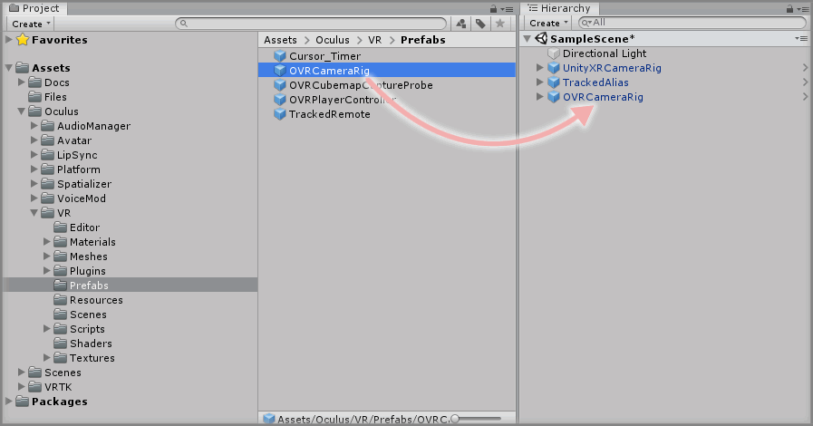
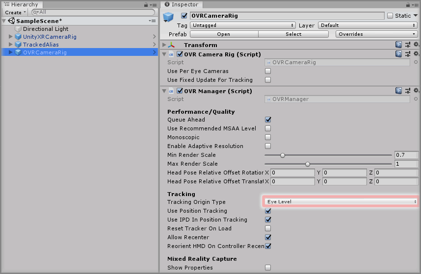
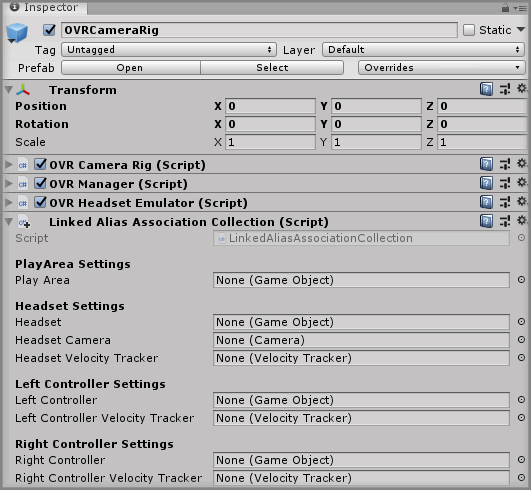
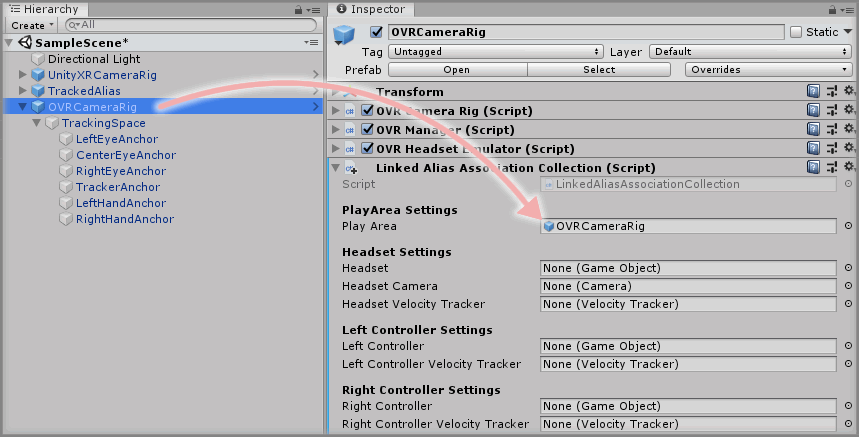
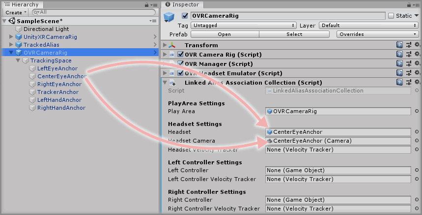
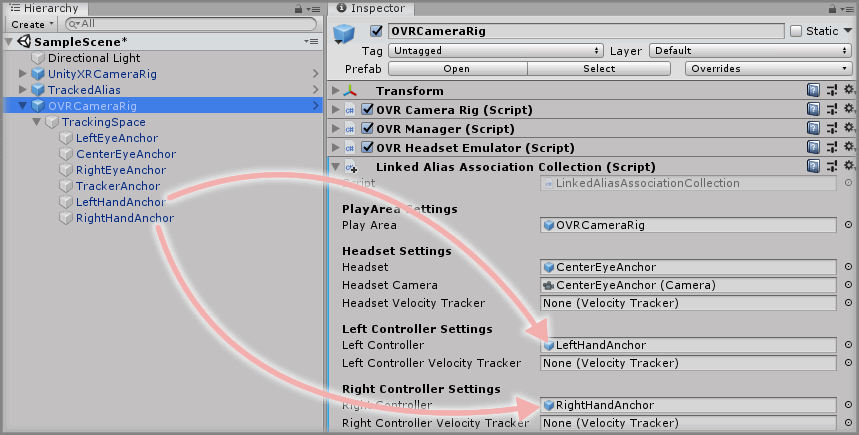
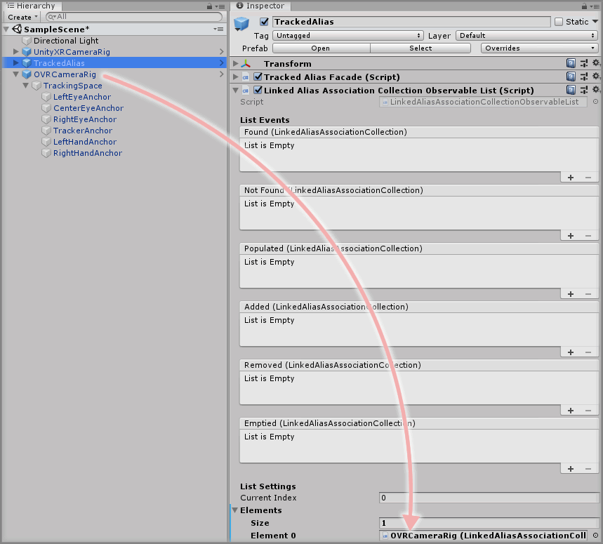

&gt; [Home](../../../../../README.md) &gt; [Tutorials](../../../README.md) &gt; [Working With 3rd Party SDKs](../../README.md) &gt; [Using Oculus Integration](../README.md)

# Working With The OVRCameraRig

> * Level: Beginner
>
> * Reading Time: 5 minutes
>
> * Checked with: Unity 2018.3.10f1 and Oculus Integration 1.35

## Introduction

The OVRCameraRig is a prefab from the Oculus Integration Unity Package that describes the common elements of a VR setup such as the play area boundaries, headset and controller positions and orientation.

## Useful definitions

* `HMD` - A Head Mounted Display is a display device that is worn on the head, usually a VR/AR Headset.
* `CameraRig` - A GameObject that contains a HMD representation and controller representations.
* `6 degrees of freedom` - An object that is real world tracked in the 3 rotational axes and 3 directional axes, also known as room scale tracking.
* `3 degrees of freedom` - An object that is real world tracked in only the 3 rotational axes and no directional axes, also known as stationary tracking.

## Prerequisites

* [Oculus Integration](https://assetstore.unity.com/packages/tools/integration/oculus-integration-82022) has been downloaded and installed in the project.
* A TrackedAlias is set up in the scene. See [Adding A TrackedAlias](../../../../../Documentation/HowToGuides/CameraRigs/AddingATrackedAlias/README.md).

## Let's Start

### Step 1

Expand the Oculus directory in the Unity Project window until the `Oculus -> VR -> Prefabs` directory is visible and select the `Prefabs` directory so the contents are displayed then select the `OVRCameraRig` prefab then drag and drop it into the Hierarchy window.

### Step 2

Select the `OVRCameraRig` GameObject in the Unity Hierarchy window and review the settings in the `OVR Manager` component.

The tracking type will determine how the HMD is placed in the scene and is different for devices depending on their degrees of freedom.

* Ensure the `Tracking Origin Type` is set to:
  * `Floor Level` for XR devices that support 6 degrees of freedom tracking (the ability to move around your play area).
  * `Eye Level` for XR devices that support 3 degrees of freedom tracking (only the ability to look around but not move within your play area).

### Step 3

Now there is an `OVRCameraRig` configured in the scene so it's time to wrap it with VRTK so it can be utilized by the `TrackedAlias` prefab.

Click on the `Add Component` button on the `OVRCameraRig` GameObject and then select the `Linked Alias Association Collection` component.

This component allows us to specify which elements of the `OVRCameraRig` prefab relate to the tracked elements required by the VRTK `TrackedAlias` prefab.

### Step 4

Expand the `OVRCameraRig` GameObject in the Unity Hierarchy window until it is fully expanded and showing all child GameObjects. These child GameObjects represent the parts of the `OVRCameraRig` that make up the elements of the VR setup.

Let's start by linking the `Play Area` by dragging and dropping the `OVRCameraRig` GameObject into the `Play Area` parameter on the `Linked Alias Association Collection` component.

### Step 5

Now to set up the Headset links, which comes in 3 parts:

* `Headset` - The GameObject that represents the physical HMD.
* `Headset Camera` - The scene Camera that renders the virtual view within the HMD.
* `Headset Velocity Tracker` - The Velocity Tracker component that contains the data on the HMD's current velocity and angular velocity.

For now, we'll only set up the `Headset` and `Headset Camera` parameters as we have no `Headset Velocity Tracker` for the Oculus Integration SDK that is compatible with VRTK but we'll come back to this later in the tutorial on how to create one.

Drag and drop the `OVRCameraRig -> TrackingSpace -> CenterEyeAnchor` GameObject into both the `Headset` and `Headset Camera` parameters on the `Linked Alias Association Collection` component.

### Step 6

Now to set up the Controller links. Oculus Integration supports two controllers a `Left` and a `Right` controller, each controller comes in 2 parts:

* Left Controller
  * `Left Controller` - The GameObject that represents the physical left controller.
  * `Left Controller Velocity Tracker` - The Velocity Tracker component that contains the data on the Left Controller's current velocity and angular velocity.
* Right Controller
  * `Right Controller` - The GameObject that represents the physical right controller.
  * `Right Controller Velocity Tracker` - The Velocity Tracker component that contains the data on the Right Controller's current velocity and angular velocity.

For now, we'll only set up the `Left Controller` and `Right Controller` parameter as we have no `Left Controller Velocity Tracker` or `Right Controller Velocity Tracker` for the Oculus Integration SDK that is compatible with VRTK but we'll come back to this later in the tutorial on how to create one.

Drag and drop the `OVRCameraRig -> TrackingSpace -> LeftHandAnchor` GameObject into the `Left Controller` parameter on the `Linked Alias Association Collection` component then drag and drop the `OVRCameraRig -> TrackingSpace -> RightHandAnchor` GameObject into the `Right Controller` parameter on the `Linked Alias Association Collection` component.

### Step 7

The `OVRCameraRig` has now been configured so VRTK can recognize the various required elements for the `TrackedAlias` prefab. All that is left is to add the `OVRCameraRig` to our `TrackedAlias` in the scene.

Select the `TrackedAlias` GameObject from the Unity Hierarchy window then drag and drop the `OVRCameraRig` GameObject into the `Camera Rigs -> Elements -> Element 0` parameter on the `Tracked Alias Facade` component.

> Note: This `Element 0` parameter should already exist from the previous set up of the `TrackedAlias`, however if it doesn't exist then simply set the `Size` parameter to `1`.

> If there is still a `UnityXRCameraRig` GameObject in the scene (as it was created as a prerequisite for the TrackedAlias guide) then you can disable the GameObject or delete it as it won't be required now there is an Oculus Integration CameraRig in the scene.

### Done

Now you have an Oculus Integration SDK CameraRig in your scene. If you play the Unity scene you will see that the game Main Camera is tracking the XR HMD and if there is a connected left and/or right XR controller then they will be tracking the Left/Right Anchors of the Oculus Integration CameraRig.

## Related Reading

* [Creating An OVR Velocity Tracker](../CreatingAnOVRVelocityTracker/README.md)